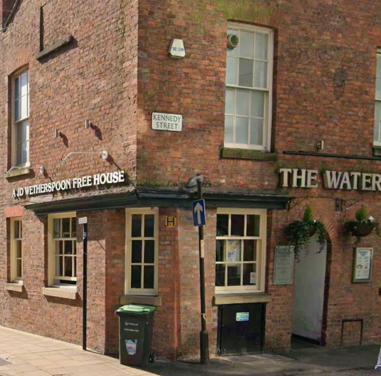
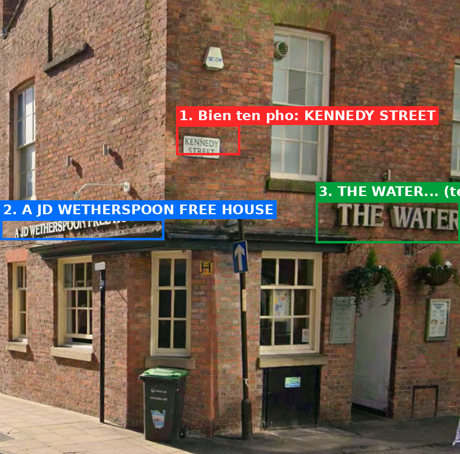
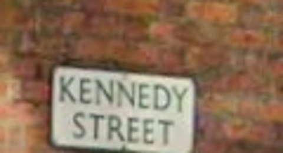
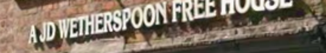
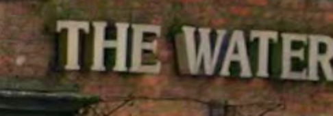
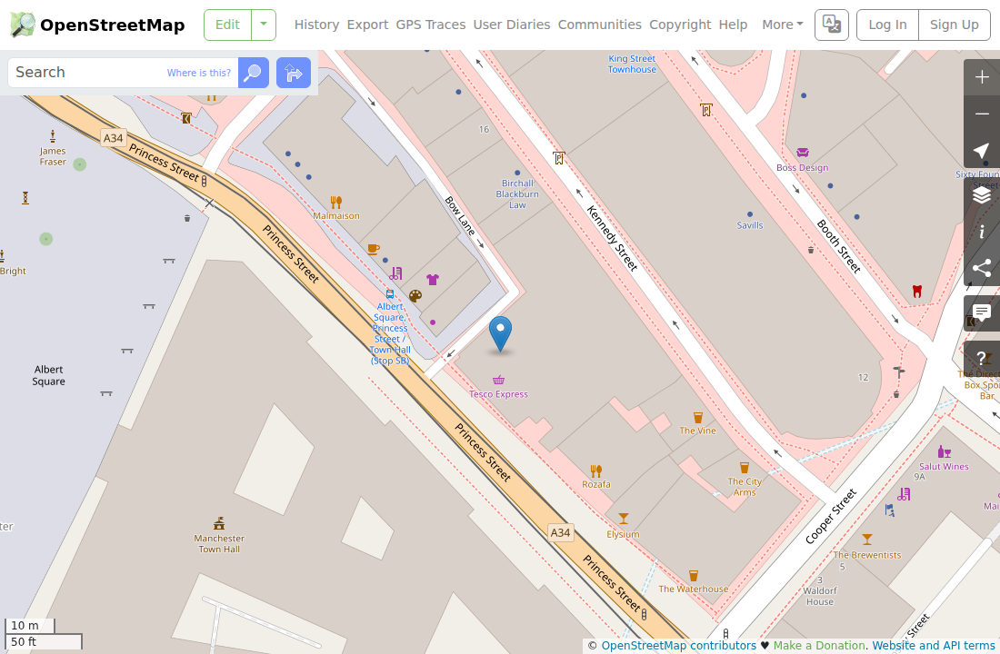

## Đề bài
The journey didn't start with a grand landmark or a famous skyline. It began at a quiet corner, the kind of place most people would walk past without a second glance. The air carried the faint scent of old brick and fresh conversation. A single street sign hung nearby, and across the road, a familiar name lingered above the doorway, one you might have seen before, if you've ever wandered far enough.

Nothing about this place screams importance. And yet... it's exactly where the trail begins. **Find where this moment was captured.**

Flag Format: `FirstFlag{city_country}` — ví dụ `FirstFlag{newyork_unitedstates}`
## Solution
Truy cập vào lab, ta được cho một tấm ảnh chụp góc phố và cần xác định `city_country` nơi ảnh được chụp. Đây là dạng `geolocation` nên không có payload hay script để "giải" — ta phải **quan sát các manh mối trong ảnh** rồi suy luận.

Phóng to soi từng chi tiết, ta khoanh được 3 manh mối cần lưu ý:

1. Biển tên phố ghi `KENNEDY STREET`. Kiểu biển nền trắng chữ đen này rất đặc trưng của Vương quốc Anh (UK).

2. Dòng chữ trên quán `A JD WETHERSPOON FREE HOUSE`. `JD Wetherspoon` là một chuỗi pub chỉ có ở Anh & Ireland -> gần như chắc chắn đây là UK.

3. Chữ lớn gắn trên tường `THE WATER...` bị cạnh ảnh cắt mất phần đuôi. Ghép lại ta đoán là `The Waterhouse`.

Vậy ta có một pub tên `The Waterhouse`, thuộc chuỗi `Wetherspoon`, nằm trên `Kennedy Street`. Ba manh mối này ghép lại chỉ về một địa điểm duy nhất.

Ta search nhanh [`The Waterhouse Wetherspoon Kennedy Street`](https://www.jdwetherspoon.com/pubs/the-waterhouse-manchester/) -> đây là pub tại **Manchester**, Anh Quốc. Đối chiếu trên bản đồ, đúng toà nhà gạch đỏ ở góc phố trong ảnh:

Trên bản đồ ta thấy rõ `The Waterhouse`, `Kennedy Street`, cạnh `The Vine`, `The City Arms`, gần `Manchester Town Hall` — khớp hoàn toàn.

:::info
Với ảnh geolocation, ta ưu tiên soi những thứ "neo" được vị trí: biển tên phố, biển hiệu cửa hàng/quán, biển số xe, kiểu ổ cắm/đèn giao thông, ngôn ngữ trên biển. Một cái tên thương hiệu đặc thù (ở đây là `Wetherspoon`) thường thu hẹp quốc gia ngay lập tức; ghép thêm tên riêng của quán + tên phố rồi search là chốt được toạ độ.
:::

Ghép flag theo format `FirstFlag{city_country}` (viết thường, bỏ dấu cách):
1. city = `manchester`
2. country = `unitedkingdom`

-> Flag: `FirstFlag{manchester_unitedkingdom}`
