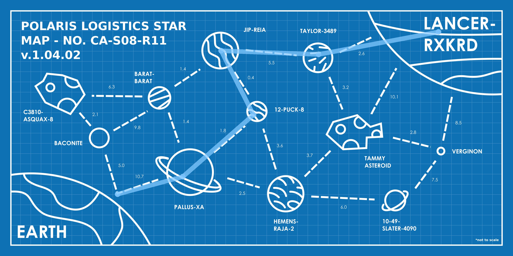

## Đề bài
(You may have seen this last year)

Polaris Logistics has an urgent delivery that needs to be transported across the star system. As the pilot of this V.I.P. (Very Important Package), you need to begin planning your trip from *Earth* to *Lancer-RXKRD* immediately. Remember to follow company protocol; you *have* to follow the designated paths between planet/oids to comply with interplanetary law. If you can’t deliver the V.I.P. in under 25 days, you might as well forget about your end of year bonus.

\- Polaris Logistics.

Submit your flag using the by combining the first character of each planet/oid in your path together and then adding the number of days your path takes (with 1 decimal place) onto the end, separated by a dash. E.g. if your path from A-PLANET TO B-PLANET was PAPA, OSCAR, SIERRA, TANGO, 2025PLANET and took exactly 5 days, the flag would be `CSSCTF{POST2-5.0}`

## Solution
Truy cập vào challenge, ta được cho một tấm bản đồ sao của Polaris Logistics:


Đọc kỹ đề, ta rút ra đúng một bài toán quen thuộc:

1. Các hành tinh là node, các đường kẻ đứt nối giữa chúng là cạnh (edge), con số trên mỗi đường là trọng số (số ngày bay).
2. Ta phải đi từ `EARTH` tới `LANCER-RXKRD`, chỉ được bám theo các đường có sẵn, và tổng số ngày phải dưới 25.

Vậy đây chính là bài toán `shortest path` (đường đi ngắn nhất) trên đồ thị có trọng số. Cái tên *"A Star Trail"* cũng là một cú chơi chữ rất duyên: [`A*`](https://en.wikipedia.org/wiki/A*_search_algorithm) là thuật toán tìm đường kinh điển — nhưng với đồ thị nhỏ như này, một lượt [`Dijkstra`](https://en.wikipedia.org/wiki/Dijkstra%27s_algorithm) (hay thậm chí nhẩm tay) là đủ.

### Trích xuất đồ thị từ ảnh

Ta đọc từng cạnh và trọng số trực tiếp trên bản đồ:

| Cạnh | Ngày |
|---|---|
| EARTH — BACONITE | 5.0 |
| EARTH — PALLUS-XA | 10.7 |
| BACONITE — C3810-ASQUAX-8 | 2.1 |
| BACONITE — BARAT-BARAT | 9.8 |
| C3810-ASQUAX-8 — BARAT-BARAT | 6.3 |
| BARAT-BARAT — JIP-REIA | 1.4 |
| BARAT-BARAT — PALLUS-XA | 1.4 |
| PALLUS-XA — 12-PUCK-8 | 1.8 |
| PALLUS-XA — HEMENS-RAJA-2 | 2.5 |
| JIP-REIA — 12-PUCK-8 | 0.4 |
| JIP-REIA — TAYLOR-3489 | 5.5 |
| 12-PUCK-8 — HEMENS-RAJA-2 | 3.6 |
| TAYLOR-3489 — LANCER-RXKRD | 2.6 |
| TAYLOR-3489 — TAMMY ASTEROID | 3.2 |
| HEMENS-RAJA-2 — TAMMY ASTEROID | 3.7 |
| HEMENS-RAJA-2 — 10-49-SLATER-4090 | 6.0 |
| TAMMY ASTEROID — VERGINON | 2.8 |
| TAMMY ASTEROID — LANCER-RXKRD | 10.1 |
| VERGINON — LANCER-RXKRD | 8.5 |
| VERGINON — 10-49-SLATER-4090 | 7.5 |

:::info
Đề ghi *"not to scale"* ngay góc dưới — nên tuyệt đối không được ước lượng khoảng cách bằng mắt. Chỉ có con số ghi trên cạnh mới là trọng số thật.
:::

### Chạy Dijkstra

Nhập đồ thị vào rồi để máy tìm đường ngắn nhất `EARTH -> LANCER-RXKRD`:

```python!
import heapq

E = [
    ("EARTH","BACONITE",5.0), ("EARTH","PALLUS-XA",10.7),
    ("BACONITE","C3810-ASQUAX-8",2.1), ("BACONITE","BARAT-BARAT",9.8),
    ("C3810-ASQUAX-8","BARAT-BARAT",6.3),
    ("BARAT-BARAT","JIP-REIA",1.4), ("BARAT-BARAT","PALLUS-XA",1.4),
    ("PALLUS-XA","12-PUCK-8",1.8), ("PALLUS-XA","HEMENS-RAJA-2",2.5),
    ("JIP-REIA","12-PUCK-8",0.4), ("JIP-REIA","TAYLOR-3489",5.5),
    ("12-PUCK-8","HEMENS-RAJA-2",3.6),
    ("TAYLOR-3489","LANCER-RXKRD",2.6), ("TAYLOR-3489","TAMMY ASTEROID",3.2),
    ("HEMENS-RAJA-2","TAMMY ASTEROID",3.7), ("HEMENS-RAJA-2","10-49-SLATER-4090",6.0),
    ("TAMMY ASTEROID","VERGINON",2.8), ("TAMMY ASTEROID","LANCER-RXKRD",10.1),
    ("VERGINON","LANCER-RXKRD",8.5), ("VERGINON","10-49-SLATER-4090",7.5),
]
adj = {}
for a, b, w in E:
    adj.setdefault(a, []).append((b, w))
    adj.setdefault(b, []).append((a, w))   # đường đi được cả 2 chiều

src, dst = "EARTH", "LANCER-RXKRD"
dist, prev, pq = {src: 0}, {}, [(0, src)]
while pq:
    d, u = heapq.heappop(pq)
    if d > dist.get(u, 1e9): continue
    for v, w in adj[u]:
        nd = round(d + w, 10)
        if nd < dist.get(v, 1e9):
            dist[v], prev[v] = nd, u
            heapq.heappush(pq, (nd, v))

path, cur = [], dst
while cur != src: path.append(cur); cur = prev[cur]
path.append(src); path.reverse()
print(round(dist[dst], 1), path)
# -> 21.0 ['EARTH', 'PALLUS-XA', '12-PUCK-8', 'JIP-REIA', 'TAYLOR-3489', 'LANCER-RXKRD']
```

-> Đường ngắn nhất: `EARTH -> PALLUS-XA -> 12-PUCK-8 -> JIP-REIA -> TAYLOR-3489 -> LANCER-RXKRD`, tổng 21.0 ngày (thoả điều kiện dưới 25).



> Để ý con đường vòng đầy "cám dỗ" phía dưới (qua Hemens-Raja-2, Tammy, Verginon) đều đắt hơn hẳn. Nhánh thắng nằm ở cặp cạnh cực rẻ `PALLUS-XA -> 12-PUCK-8` (1.8) và `12-PUCK-8 -> JIP-REIA` (0.4) — tận dụng được chúng thì tổng mới xuống thấp nhất.

### Ghép flag

Theo format đề: lấy ký tự đầu của mỗi hành tinh trên đường đi, rồi gắn số ngày (1 chữ số thập phân) vào cuối, ngăn bằng dấu `-`:

<center>

`E`ARTH · `P`ALLUS-XA · `1`2-PUCK-8 · `J`IP-REIA · `T`AYLOR-3489 · `L`ANCER-RXKRD → `EP1JTL`

</center>

Gắn `21.0` ngày vào sau:

-> Flag: `CSSCTF{EP1JTL-21.0}`
