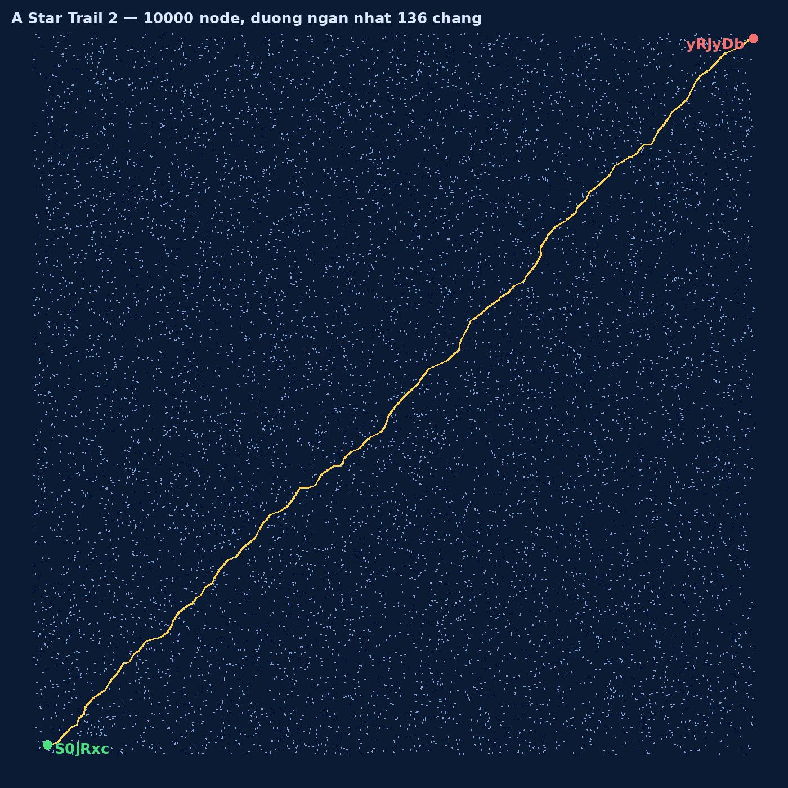

## Đề bài
Congrats on your first, successful delivery cadet! Now that you've got a small taste of logistics and routing, take a gander at this larger galactic map. You've got quite a few more stops this time but thankfully, you won't have to be put to cryosleep now that you've gained your lightspeed vehicle licence. Today, your task is to make it from planetary body `S0jRxc` to planetary body `yRJyDb`. Chart out a path and **don't** be late; we expect you to make it there in a reasonable time. You'll have to do a bit of work to make sense of everything since our database is stored as Markdown files where each planet links to its neighbours with a wikilink but it should be easy work once you get used to it.

Report to command your flightpath by taking the first letter of the ID of your first stop (`S0jRxc`), the second letter of your second stop, the third letter of your third stop, and so on, wrapping back around to the first letter on your 7th, 13th, 19th, etc. stop. Your flightpath flag is case sensitive. For example: if your path from ASTART to ZFINAL was BCDEFG, hijklm, NOPQRS, tuvwxy, ZFINAL the flag would be `CSSCTF{ACjQxL}`

\- Polaris Logistics.

## Solution
Bài này là phiên bản "phóng to" của [A Star Trail 1](/posts/a-star-trail-1/): vẫn là `shortest path`, nhưng lần này đồ thị không nằm trong một tấm ảnh nữa mà được giấu trong một `map.zip`. Giải nén ra, ta có nguyên một **vault Obsidian** gồm `10000` file Markdown — mỗi file là một hành tinh:

```bash!
unzip map.zip && ls map/map | wc -l   # -> 10000
cat map/map/S0jRxc.md
```

```markdown!
# S0jRxc

Coords: 1.937346, 1.274873


[[1T5eN4]]
[[1T5WDS]]
[[SwjzJx]]
[[NygbEQ]]
[[L4649b]]
```

Cấu trúc mỗi node quá rõ ràng:

1. Tên file (và heading `#`) là **ID** của hành tinh.
2. Dòng `Coords:` cho **toạ độ** `(x, y)` trong mặt phẳng.
3. Mỗi `[[...]]` là một [wikilink](https://help.obsidian.md/links) — tức một **cạnh** nối tới hành tinh hàng xóm.

Vậy "`reasonable time`" nghĩa là gì khi đề không cho sẵn số ngày trên từng cạnh? May mắn thay, ta có `Coords` — trọng số tự nhiên nhất của cạnh `A—B` chính là **khoảng cách Euclid** giữa hai toạ độ. Đi đường ngắn nhất theo tổng khoảng cách = về sớm nhất.

### Dựng đồ thị và chạy Dijkstra

Ta duyệt toàn bộ 10000 file, bóc `Coords` và các wikilink bằng regex, rồi [`Dijkstra`](https://en.wikipedia.org/wiki/Dijkstra%27s_algorithm) từ `S0jRxc` tới `yRJyDb`:

```python!
import os, re, heapq, math

D = "map/map"
coords, adj = {}, {}
for fn in os.listdir(D):
    nid = fn[:-3]
    t = open(os.path.join(D, fn), encoding="utf-8").read()
    x, y = re.search(r"Coords:\s*([-\d.]+),\s*([-\d.]+)", t).groups()
    coords[nid] = (float(x), float(y))
    adj[nid] = re.findall(r"\[\[([^\]]+)\]\]", t)

def dist(a, b):
    (ax, ay), (bx, by) = coords[a], coords[b]
    return math.hypot(ax - bx, ay - by)   # trọng số = khoảng cách Euclid

src, dst = "S0jRxc", "yRJyDb"
d, prev, pq = {src: 0.0}, {}, [(0.0, src)]
while pq:
    dd, u = heapq.heappop(pq)
    if u == dst: break
    if dd > d.get(u, 1e18): continue
    for v in adj[u]:
        nd = dd + dist(u, v)
        if nd < d.get(v, 1e18):
            d[v], prev[v] = nd, u
            heapq.heappush(pq, (nd, v))

path, cur = [], dst
while cur != src: path.append(cur); cur = prev[cur]
path.append(src); path.reverse()
print(len(path), "chặng,", round(d[dst], 2))   # -> 136 chặng, 144.93
```

Vẽ 10000 node theo toạ độ rồi tô sáng đường đi, ta thấy lộ trình cắt chéo cả bản đồ từ góc dưới-trái (`S0jRxc`) lên góc trên-phải (`yRJyDb`):



-> Đường ngắn nhất dài **136 chặng** (gồm cả điểm đầu và cuối).

### Ghép flag — con trỏ ký tự xoay vòng

Phần "khó" của bài nằm ở luật ghép flag, đọc kỹ đề: lấy **ký tự thứ 1** của ID chặng 1, **ký tự thứ 2** của chặng 2, **ký tự thứ 3** của chặng 3... tới chặng thứ 7 thì **quay vòng** về ký tự thứ 1. Nói cách khác, chặng thứ `i` (đếm từ 1) ta lấy ký tự ở vị trí `(i - 1) mod 6` (ID dài đúng 6 ký tự).

:::warning
Flag này **case-sensitive** — chữ hoa/thường phải giữ nguyên y hệt ID gốc, không được viết thường hoá.
:::

```python!
flag = "".join(nid[i % 6] for i, nid in enumerate(path))
print("CSSCTF{%s}" % flag)
```

Và đây là điểm xác nhận rằng đường đi của ta **đúng tuyệt đối**: các ký tự ghép lại không phải chuỗi ngẫu nhiên, mà ghép thành một câu có nghĩa — điểm danh đúng loạt khái niệm đứng sau bài toán này:

> `STAR map` · `DELAUNAY Triangulation` · `DIJKSTRA` · `VORONOI` · `GRAPHS` · `determinant` · `colinear` · `ALGORITHMS` · `LEE and SCHACHTER` · `TANGENTS` · `MERGE` · `CIRCUMCIRCLE` · `CONVEX HULL` · `GEOMETRY`

Chỉ cần sai một chặng là chuỗi sẽ lệch và câu vỡ ngay — nên khi thấy nó đọc trơn tru, ta biết chắc path tối ưu đã chuẩn.

-> Flag: `CSSCTF{STARmaPdElAUNaYTriaNGulATioNDIjKStrAVoRonoiGrAPHSdetERmiNaNTcolineaRALGOrITHmSLeEandsCHAcHTERTANgEnTSmErGECirCuMcIrcLEcOnVEXhuLLgeOMeTRy}`
