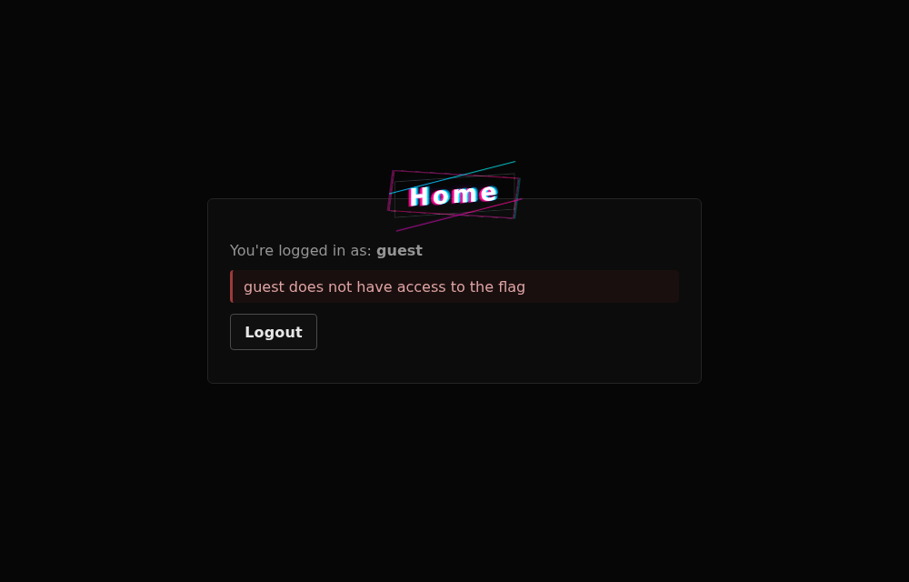
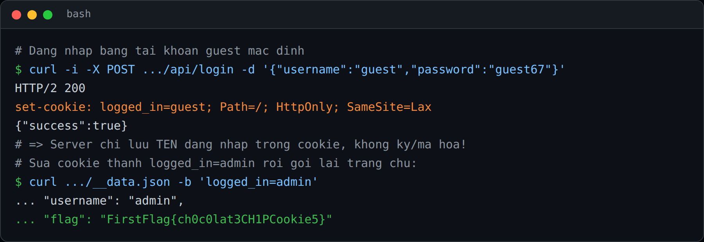

## Đề bài
AI generated this website for us. It's super duper secure!

https://first-flag-absurd-admin.netlify.app/

Flag Format: `FirstFlag{<flag>}`
## Solution
Truy cập vào challenge, ta thấy trang chủ yêu cầu đăng nhập để xem thông tin tài khoản:


Vào `/login`, trang còn "tốt bụng" ghi luôn tài khoản mặc định `guest / guest67`:


Đăng nhập bằng `guest`, ta vào được nhưng nhận thông báo `guest does not have access to the flag` -> ta cần là `admin` mới xem được flag.



Vậy câu hỏi là: server dựa vào đâu để biết "ta là ai"? Ta mở DevTools tab Network (hoặc dùng `curl`) để soi response của `POST /api/login`, đoạn cần lưu ý là header `Set-Cookie`:



```http!
set-cookie: logged_in=guest; Path=/; HttpOnly; SameSite=Lax
```

Ta nhận thấy server **lưu thẳng tên đăng nhập vào giá trị cookie** — không ký (sign), không mã hoá, không dùng session id ngẫu nhiên. Khi tải trang chủ, server đọc luôn `logged_in` để quyết định quyền. Đây chính là lỗ hổng `Broken Access Control` kinh điển: tin tưởng dữ liệu do client giữ.

-> Ta chỉ cần sửa cookie `logged_in` từ `guest` thành `admin`.

1. `logged_in=admin` để server tưởng ta là admin
2. Reload trang chủ để server render lại dữ liệu kèm flag

Trên trình duyệt: DevTools -> tab Application -> Cookies -> sửa `logged_in` thành `admin` -> `F5`. Flag hiện ngay trên trang:


Hoặc dùng `curl` cho nhanh:
```bash!
curl 'https://first-flag-absurd-admin.netlify.app/__data.json' -b 'logged_in=admin'
# ... "username": "admin", "flag": "FirstFlag{ch0c0lat3CH1PCookie5}"
```

:::warning
`HttpOnly` chỉ chặn JavaScript đọc cookie, chứ **không** ngăn ta tự sửa cookie bằng DevTools hay `curl`. Cookie phân quyền phải là session id tra ở server, hoặc token được ký (HMAC/JWT có chữ ký).
:::

-> Flag: `FirstFlag{ch0c0lat3CH1PCookie5}`
