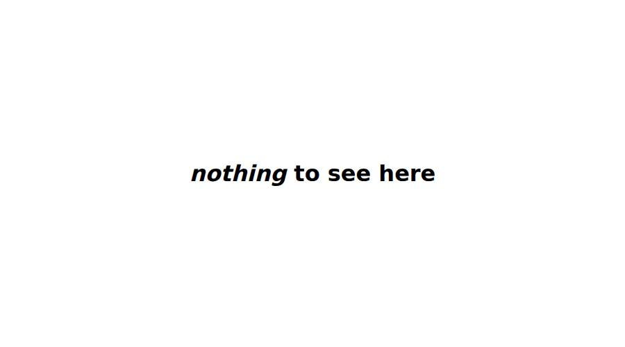
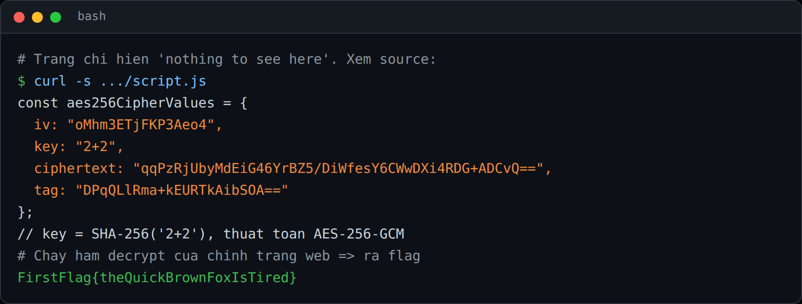
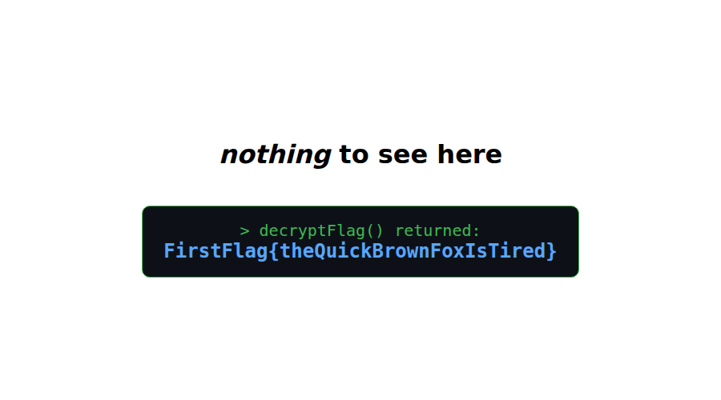

## Đề bài
At first glance, this looks like an innocent website. Super empty. But is it?

https://first-flag-secret-sentences.netlify.app/

Flag Format: `FirstFlag{<flag>}`
## Solution
Truy cập vào lab, ta thấy trang chỉ hiện đúng một dòng `nothing to see here`:



"Super empty" chỉ là vẻ bề ngoài. Ta xem source HTML thì thấy trang nạp 2 file JS, đoạn cần lưu ý:
```html!
<script src="./flag.js"></script>     <!-- chỉ là comment troll -->
<script src="./script.js"></script>   <!-- toàn bộ bí mật nằm đây -->
```
Mở `flag.js` ra chỉ có một câu trêu: `// cmon, you didn't think it was going to be *that* easy, did you?`. Vậy ta chuyển qua đọc `script.js`.



Ta nhận thấy toàn bộ tham số mã hoá đã bị **để lộ ngay trong JavaScript phía client**:
```javascript!
const aes256CipherValues = {
  iv:         "oMhm3ETjFKP3Aeo4",
  key:        "2+2",
  ciphertext: "qqPzRjUbyMdEiG46YrBZ5/DiWfesY6CWwDXi4RDG+ADCvQ==",
  tag:        "DPqQLlRma+kEURTkAibSOA=="
};
```
Đọc tiếp hàm `decryptFlag()` trong file, ta thấy cơ chế:
1. `key` thật = `SHA-256("2+2")` (băm chuỗi `"2+2"` để lấy 32 byte)
2. Thuật toán là `AES-256-GCM` (WebCrypto), với `iv`, `ciphertext`, `tag` đều là base64
3. Tác giả cố tình "không log, không return" flag rồi nghĩ rằng thế là không ai lấy được

Vậy `security phía client` là gì? Về cơ bản, nó **không tồn tại**: mọi thứ gửi tới trình duyệt (JS, key, ciphertext) thì ta đều đọc và chạy lại được. Việc không in flag ra không làm nó an toàn hơn.

-> Cách nhanh nhất ngay trên trình duyệt là mở DevTools -> Console, gọi lại chính hàm `decryptFlag()` của trang (sửa để `return`/`console.log` kết quả). Flag hiện ra:



Hoặc ta tự giải bằng Python, lưu ý `GCM` cần `tag` để verify:
```python!
key = hashlib.sha256(b"2+2").digest()
iv  = base64.b64decode("oMhm3ETjFKP3Aeo4")
ct  = base64.b64decode("qqPzRjUbyMdEiG46YrBZ5/DiWfesY6CWwDXi4RDG+ADCvQ==")
tag = base64.b64decode("DPqQLlRma+kEURTkAibSOA==")
AES.new(key, AES.MODE_GCM, nonce=iv).decrypt_and_verify(ct, tag)
# -> b'FirstFlag{theQuickBrownFoxIsTired}'
```

:::info
Cách dẫn xuất key ở đây là `SHA-256` của một chuỗi rất ngắn (`"2+2"`). Kể cả khi tác giả không viết sẵn `key` trong file, ta vẫn dễ dàng đoán/bruteforce vì không gian đầu vào quá nhỏ.
:::

-> Flag: `FirstFlag{theQuickBrownFoxIsTired}`
