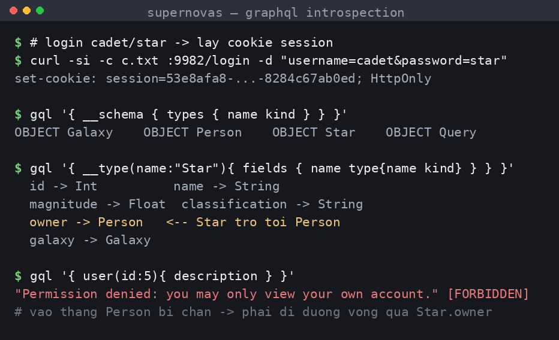
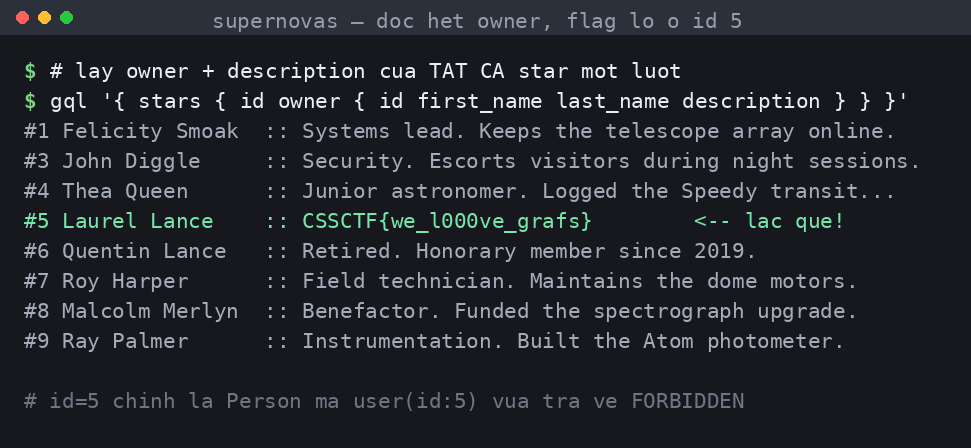

## Đề bài
The Star City Observatory keeps a catalogue of stars, their galaxies, and their owners. Some records are more private than others.

http://34.116.80.78:9982/

Flag Format: `CSSCTF{...}`
## Solution
Truy cập vào lab, ta thấy một ứng dụng `SvelteKit` tên **Star City Observatory**, vào `/login` thì trang còn "tốt bụng" cho luôn tài khoản mặc định `cadet/star`:
```html!
<title>Log in · Star City Observatory</title>
...
<p class="hint">Need an account? <code>cadet/star</code>.</p>
```
Đăng nhập xong ta được cấp một cookie `session`. Mò quanh site thì thấy mọi dữ liệu (stars, galaxies, người sở hữu) đều được lấy về qua một endpoint `/graphql`. Thử `GET` thẳng vào đó:
```bash!
curl http://34.116.80.78:9982/graphql
# -> {"errors":[{"message":"Must provide query string." ...}]}
```
-> Server nói thẳng đây là một [GraphQL](https://graphql.org/) endpoint. Với GraphQL, câu hỏi đầu tiên của ta luôn là: *schema trông như thế nào?* May mắn thay, server **bật introspection** — tính năng cho phép ta hỏi ngược lại chính schema của nó.

> `introspection` là cơ chế "tự khai báo" của GraphQL: ta gửi một query đặc biệt (`__schema`, `__type`) và server trả về toàn bộ danh sách type, field, argument. Với người phòng thủ nó tiện cho tài liệu; với ta nó là tấm bản đồ kho báu.

Ta hỏi danh sách type:
```graphql!
{ __schema { types { name kind } } }
```
Bỏ qua các type built-in, còn lại 4 `OBJECT` đáng chú ý: `Query`, `Star`, `Galaxy`, `Person`. Đào tiếp vào từng type để xem field:



```graphql!
{ __type(name:"Star") {
    fields { name type { name kind ofType { name kind } } }
} }
```
Đoạn cần lưu ý nằm ở type `Star`:
```
id, name, magnitude, classification, spectralClass
galaxy  -> Galaxy
owner   -> Person      <-- một Star trỏ tới người sở hữu là Person
```
Còn type `Person` thì chứa các thông tin cá nhân: `first_name`, `last_name`, `date_of_birth`, `description`. Còn `Query` (các "cửa" để ta truy vấn) thì có:
```
stars             # list toàn bộ Star
star(id)          # 1 Star theo id
galaxies / galaxy(id)
user(id) -> Person   # 1 Person theo id
```

Nhìn vào đây, con đường "thẳng" để đọc thông tin một người là `user(id:...)`. Ta thử:
```graphql!
{ user(id:5) { first_name last_name description } }
```
```json!
{"errors":[{"message":"Permission denied: you may only view your own account.",
  "extensions":{"code":"FORBIDDEN"}}], "data":{"user":null}}
```
-> Resolver `user` có gắn một lớp kiểm tra quyền: *"bạn chỉ được xem tài khoản của chính mình"*. Đi cửa chính bị chặn.

Vậy một câu hỏi mới được sinh ra: lớp phân quyền đó được đặt ở **đâu**? Ở GraphQL, mỗi field có một `resolver` riêng, và việc kiểm tra quyền phải được cài **thủ công ở từng resolver**. Tác giả đã nhớ khoá `Query.user`, nhưng field `owner` của `Star` cũng trả về đúng kiểu `Person` đó — liệu nó có được khoá không?

Ta thử đi **con đường vòng**: thay vì hỏi thẳng `Person`, ta hỏi `Star` rồi men theo quan hệ `owner` để chạm tới `Person`. Mà lúc này ta còn chưa biết chủ nhân nào mới là "người cần moi", nên cứ lấy **owner của tất cả các Star một lượt**, bồi luôn field `description` vào cho đỡ mất công:
```graphql!
{ stars { id name owner { id first_name last_name description } } }
```
Lần này server trả về ngon lành — lớp phân quyền ở đây **không tồn tại**. Toàn bộ chủ nhân các ngôi sao hiện ra, và họ là dàn nhân vật của series *Arrow* (bối cảnh **Star City**): Felicity Smoak, John Diggle, Thea Queen, Laurel Lance...



Đọc lướt qua thì `description` của hầu hết mọi người đều là mấy dòng "hồ sơ" bình thường — *"Systems lead. Keeps the telescope array online."*, *"Security. Escorts visitors..."*, *"Junior astronomer..."*. Nhưng tới `Star` tên **Black Canary**, mô tả của owner lại lạc quẻ hẳn so với phần còn lại:
```json!
{ "id": 5, "first_name": "Laurel", "last_name": "Lance",
  "description": "CSSCTF{we_l000ve_grafs}" }
```
Để ý `id` của người này đúng bằng `5` — chính là `Person` mà lúc nãy `user(id:5)` đã phũ phàng trả về `FORBIDDEN`. Ta vừa đọc được đúng bản ghi bị cấm, chỉ bằng cách vòng qua một `Star` mà mình được phép xem.

Đây chính là lỗ hổng [Broken Object Level Authorization](https://owasp.org/API-Security/editions/2023/en/0xa1-broken-object-level-authorization/) (BOLA/IDOR) trong ngữ cảnh GraphQL: cùng một object `Person` nhưng có **hai con đường** tới nó (`Query.user` và `Star.owner`), tác giả chỉ vá đúng một cửa. Ta đọc được `Person(id:5)` mà lẽ ra bị cấm, chỉ nhờ đi qua một `Star` mà mình được phép xem.

:::warning
Phân quyền trong GraphQL không nên đặt rải rác ở từng resolver "cửa chính". Vì mọi type đều có thể tới được qua nhiều đường quan hệ (`nested field`), lớp kiểm tra quyền phải gắn vào **chính object type** (ví dụ ngay trong resolver của `Person`), chứ không phải chỉ ở `Query.user`. Ngoài ra nên **tắt introspection** trên production để không tặng luôn tấm bản đồ schema cho attacker.
:::

-> Flag: `CSSCTF{we_l000ve_grafs}`
