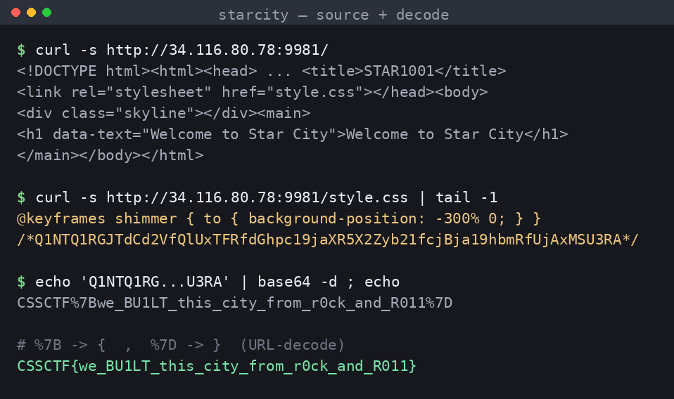

## Đề bài
Welcome to Star City. Home of stars galore. But is there more to be seen than meets the eye?

http://34.116.80.78:9981/

Flag Format: `CSSCTF{...}`
## Solution
Truy cập vào lab, ta thấy một trang tĩnh rất "hào nhoáng": tên `STAR1001`, một dòng chữ `Welcome to Star City` nhấp nháy với hiệu ứng glitch, phía dưới là đường chân trời thành phố đầy sao.


Đề bài nhấn mạnh *"more to be seen than meets the eye"* — tức là thứ ta **nhìn thấy** trên màn hình không phải tất cả. Đây là dấu hiệu kinh điển của một bài `source code review`: bí mật nằm trong chính những file mà trình duyệt tải về. Ta xem source HTML thì thấy trang chỉ có đúng một `element` nội dung và nạp thêm một file CSS, đoạn cần lưu ý:
```html!
<h1 data-text="Welcome to Star City">Welcome to Star City</h1>
<link rel="stylesheet" href="style.css">
```
Trang gần như trống trơn, JavaScript cũng không có. Vậy chỗ duy nhất còn lại để "giấu" chính là `style.css`. Ta kéo hết file CSS xuống cuối, và ngay sau `@keyframes` cuối cùng có một [CSS comment](https://developer.mozilla.org/en-US/docs/Web/CSS/Comments) lạc lõng:



```css!
@keyframes shimmer { to { background-position: -300% 0; } } /*Q1NTQ1RGJTdCd2VfQlUxTFRfdGhpc19jaXR5X2Zyb21fcjBja19hbmRfUjAxMSU3RA*/
```
Chuỗi trong comment chỉ gồm `[A-Za-z0-9]`, không có ký tự lạ, độ dài là bội số quen thuộc — đúng dáng của [Base64](https://developer.mozilla.org/en-US/docs/Glossary/Base64). Ta thử `base64 -d`:
```bash!
echo 'Q1NTQ1RGJTdCd2VfQlUxTFRfdGhpc19jaXR5X2Zyb21fcjBja19hbmRfUjAxMSU3RA' | base64 -d
# -> CSSCTF%7Bwe_BU1LT_this_city_from_r0ck_and_R011%7D
```
Kết quả vẫn chưa "sạch": còn `%7B` và `%7D` — đó là [URL-encode](https://developer.mozilla.org/en-US/docs/Glossary/Percent-encoding) của `{` và `}`. Vậy chuỗi đã bị bọc **hai lớp**: `URL-encode` rồi tới `Base64`. Ta bóc nốt lớp ngoài:

1. `base64 -d` để lấy lại chuỗi gốc bị percent-encode
2. `urldecode`: `%7B` -> `{`, `%7D` -> `}`

-> Flag hiện ra:
```python!
import base64, urllib.parse
s = "Q1NTQ1RGJTdCd2VfQlUxTFRfdGhpc19jaXR5X2Zyb21fcjBja19hbmRfUjAxMSU3RA"
print(urllib.parse.unquote(base64.b64decode(s + "==").decode()))
# -> CSSCTF{we_BU1LT_this_city_from_r0ck_and_R011}
```

:::info
Cái tên `Star City` cộng với `we BU1LT this city from r0ck and R011` là một câu đùa nhại lại bài hát *"We Built This City"* của ban nhạc **Starship** — "we built this city on rock and roll". Đúng chất một bài web warmup.
:::

-> Flag: `CSSCTF{we_BU1LT_this_city_from_r0ck_and_R011}`
