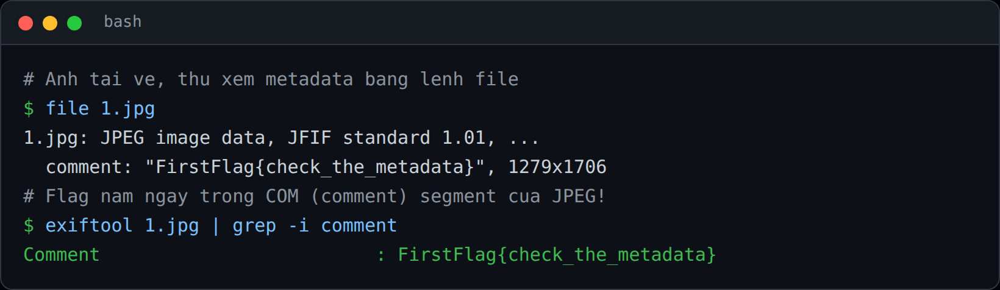

## Đề bài
Deep down, behind the picture, is where tresure was hidden.

Find the Tresure!

Flag Format: `FirstFlag{flag}`
## Solution
Truy cập vào challenge, ta được cho một tấm ảnh `1.jpg`:


Đề nói `behind the picture` (đằng sau bức ảnh) -> đây là gợi ý kho báu **không nằm ở nội dung ảnh** mà nằm ở phần dữ liệu đi kèm file, tức `metadata`.

Vậy ta thử soi metadata. Không cần tool gì phức tạp, chỉ một lệnh `file` (hoặc `exiftool`) là flag đã lộ ra ngay trong `comment` của file JPEG:



```bash!
file 1.jpg
# 1.jpg: JPEG image data ... comment: "FirstFlag{check_the_metadata}" ...

exiftool 1.jpg | grep -i comment
# Comment : FirstFlag{check_the_metadata}
```

:::info
Vì sao lại có chỗ này để giấu? File JPEG được chia thành các `segment`, mỗi segment mở đầu bằng `0xFF` + một byte marker. Marker của phần chú thích là `0xFFFE` (COM). Ngay sau marker là 2 byte độ dài (big-endian), rồi tới nội dung chú thích -> flag được nhét thẳng vào đây.
:::

Nếu muốn tự đọc segment mà không cần cài thêm tool, ta làm như sau:
```python!
data = open("1.jpg", "rb").read()
i = data.find(b"\xff\xfe")                 # tìm COM marker
seg_len = int.from_bytes(data[i+2:i+4], "big")
print(data[i+4 : i+2+seg_len].decode())    # FirstFlag{check_the_metadata}
```

:::warning
Đừng nhầm bài này với `stego` giấu dữ liệu trong điểm ảnh (LSB). Ở đây flag nằm ngay trong header của file, nên với ảnh trong OSINT/Forensics ta luôn kiểm tra `metadata` đầu tiên: `file`, `exiftool`, `strings`, `binwalk`. Các field hay chứa flag: `Comment`, `Artist`, `Copyright`, `GPS`, `UserComment`.
:::

-> Flag: `FirstFlag{check_the_metadata}`
