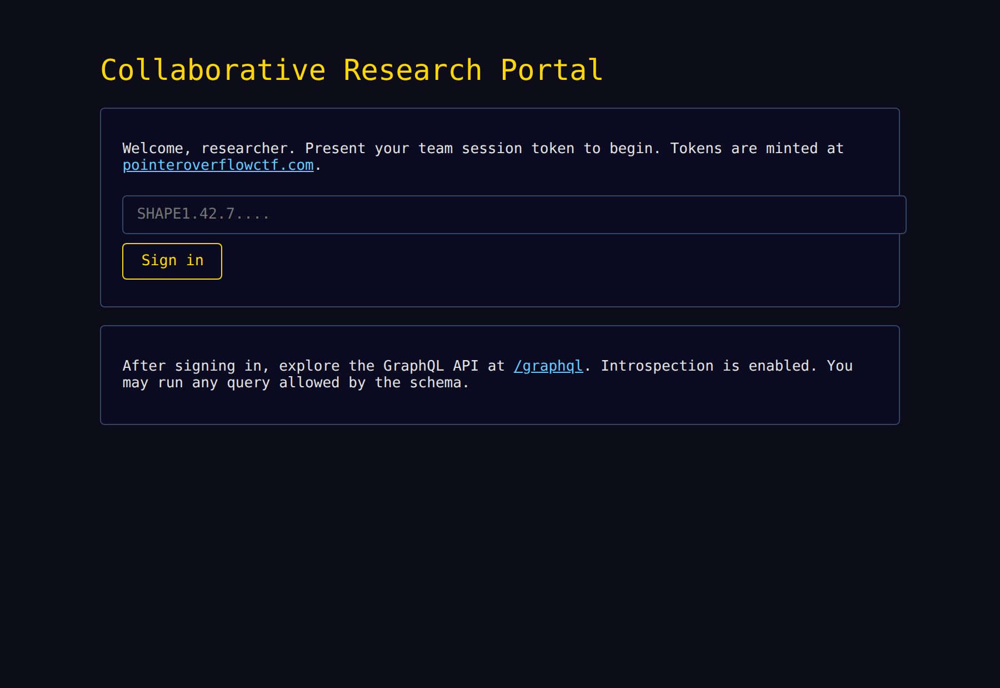
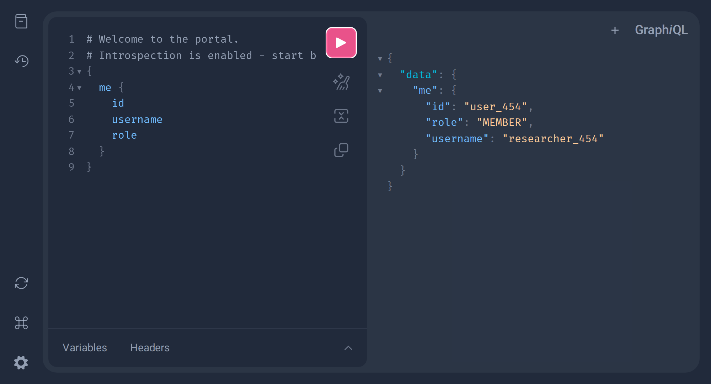
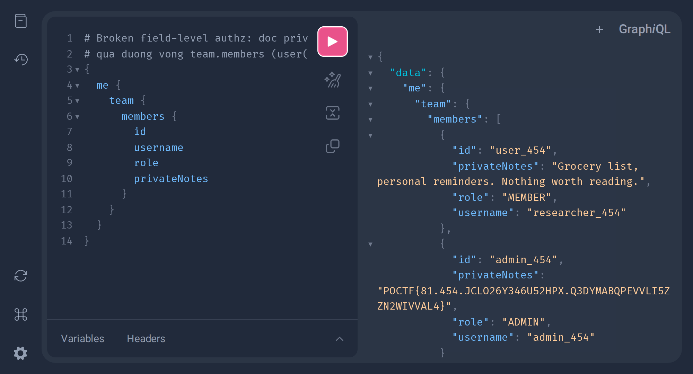

## Đề bài
A collaborative research portal where every team keeps its own private notes. You are just an ordinary member — but the admin's notes are the ones worth reading.

`https://shape-of-query.pointeroverflowctf.com/`

Flag Format: `POCTF{...}`

> Flag của bài này **gắn theo team/session**: nó nhúng `cid`, `team_id` và `nonce` của token ta dùng. Token khác → flag khác. Flag dưới đây là kết quả thật lấy từ server với token `SHAPE1.454.81.JCLO26Y346U52HPX.1790837303.J6V5R3WPZTOJ5ZQ43Z6GBBXTQK`.

## Solution
Truy cập vào lab, ta thấy một portal **"Collaborative Research Portal"** — một ô nhập *team session token* để đăng nhập, và lời nhắc *"After signing in, explore the GraphQL API at `/graphql`"*. Vậy đây là một bài **GraphQL**:



Ngay cái tên challenge — **"Shape of Query"** — đã là một gợi ý khá lộ liễu: *hình dạng của truy vấn quyết định dữ liệu mà ta chạm tới được*. Cứ ghi nhớ câu này, nó chính là chìa khoá.

Trước khi nói chuyện với API, ta phải có phiên đăng nhập. Ta mint một **session token** ở trang chủ `pointeroverflowctf.com`, token trông như này:
```
SHAPE1 . 454 . 81 . JCLO26Y346U52HPX . 1790536083 . NONG6D72XUWHJOTVT5JKOI5GQR
 ver     team  cid    nonce              timestamp     MAC
```
Thử nhập token `1` để xem token được "mổ" ra sao thì thấy nó có 6 phần ngăn bằng dấu chấm, và phần cuối là một **MAC** (HMAC) ký toàn bộ các phần trước bằng secret của server. Nghĩa là ta **không thể** tự chế token cho `team`/`cid` khác, vì không có secret để ký lại.

> Đây là tín hiệu sớm cần đọc được: lỗ hổng **không** nằm ở việc giả mạo token. Đập đầu vào MAC là ngõ cụt. Lỗ hổng (nếu có) sẽ nằm ở tầng ứng dụng, *sau khi* ta đã đăng nhập hợp lệ.

Dán token vào ô và bấm **Sign in**. Phía sau, portal gọi `/session/exchange` để đổi token lấy một cookie `session` (Flask signed cookie), rồi đưa ta thẳng vào **GraphiQL** — một IDE GraphQL ngay trong trình duyệt để gõ và chạy query, không cần công cụ dòng lệnh nào cả.

Tò mò thì mở **DevTools → tab Application → Cookies** soi cookie `session`, decode phần base64 ra thấy:
```json!
{"cid":81,"nonce":"JCLO26Y346U52HPX","team_id":454}
```
Để ý: cookie **không chứa `role`**. Nghĩa là server phải tự tra role của ta từ DB dựa trên `cid`/`team_id`, và vì cookie đã được ký nên ta cũng không sửa được để tự phong mình làm admin. Đích ngắm vì thế chuyển hướng: thay vì *trở thành* admin, ta sẽ tìm cách **đọc dữ liệu của admin mà không cần là admin** — mẫu hình kinh điển của lỗi phân quyền theo object/field.

### Introspection — dựng lại tấm bản đồ
Ở khung bên trái của GraphiQL ta gõ query, bấm nút ▶ (hoặc `Ctrl/Cmd + Enter`) để chạy, kết quả hiện ở khung bên phải. Với GraphQL, câu hỏi đầu tiên của ta luôn là: *schema trông như thế nào?* May mắn thay, server **bật introspection**.

> `introspection` là cơ chế "tự khai báo" của GraphQL: ta gửi một query đặc biệt (`__schema`, `__type`) và server trả về toàn bộ danh sách type, field, argument. Với người phòng thủ nó tiện cho tài liệu; với ta nó là tấm bản đồ kho báu. Mà ở bài này lời giải nằm ở **"đường đi" giữa các type**, nên tấm bản đồ ấy là bắt buộc phải có.

Hỏi danh sách type:
```graphql!
{ __schema { types { name kind } } }
```
Bỏ qua các type built-in (`__*`, `String`, `Boolean`...), còn lại đáng chú ý: `Query`, `User`, `Team`, `UserRoleEnum`. Đào tiếp từng type bằng `__type(name:"...")` rồi ghép lại, ta được schema rút gọn:
```graphql!
type Query {
  me: User                 # user hiện tại (suy ra từ cookie)
  user(id: ID!): User      # tra user theo id
}

type User {
  id: ID!
  username: String!
  role: UserRoleEnum       # ADMIN | MEMBER
  team: Team               # user thuộc team nào
  privateNotes: String     # <-- FIELD BÍ MẬT (chứa flag của admin)
}

type Team {
  id: ID!
  name: String
  members: [User]          # <-- QUAN HỆ VÒNG: Team chứa lại [User]
}
```
Đoạn cần lưu ý nằm ở hai chỗ:
```
User.privateNotes : String      <-- field mục tiêu, chỗ cất bí mật
Team.members      : [User]      <-- vòng User → team → members → User
```
Field `privateNotes` rõ ràng là nơi cất flag của admin. Còn `Team.members` trả về `[User]` — tức là từ một `User`, đi qua `team` rồi `members`, ta lại chạm về chính kiểu `User`. Một quan hệ **tự tham chiếu vòng**.

> Khi introspection cho thấy một object type tự tham chiếu vòng (`User.team.members: [User]`), đây là mẫu kinh điển để thử **nested authorization bypass**: nếu quyền chỉ được cài ở resolver "cửa chính", ta có thể vòng tới đúng object nhạy cảm bằng một con đường khác mà không ai canh.

### Thăm dò biên giới phân quyền
Trước khi khai thác, phải biết **chính xác** cái gì bị chặn, cái gì không. Đọc chính mình qua `me`:
```graphql!
{ me { id username role privateNotes team { id name members { id username role } } } }
```
```json!
{
  "me": {
    "id": "user_454", "role": "MEMBER",
    "privateNotes": "Grocery list, personal reminders. Nothing worth reading.",
    "team": { "id": "team_454", "name": "Research Team 454",
      "members": [
        {"id":"user_454","username":"researcher_454","role":"MEMBER"},
        {"id":"admin_454","username":"admin_454","role":"ADMIN"}
      ]}
  }
}
```

Chạy ngay trên GraphiQL cho trực quan — ta là `researcher_454`, role `MEMBER`:



Ba điều rút ra:

1. Ta là `MEMBER`, không phải admin → đừng mong đặc quyền.
2. `privateNotes` của *chính ta* đọc được bình thường → resolver **có** trả field này, vấn đề chỉ là *cho ai đọc của ai*.
3. Cùng team có `admin_454` role `ADMIN` → gần như chắc chắn flag nằm trong `admin_454.privateNotes`. Đây là mục tiêu cụ thể.

Giờ thử đi **cửa chính** `user(id)` để đọc thẳng notes của admin:
```graphql!
{ user(id:"admin_454"){ id role privateNotes } }   # -> { "user": null }
{ user(id:"user_454"){ id role privateNotes } }    # -> OK, đọc được (chính mình)
```
Resolver `user(id)` **có** kiểm tra quyền: chỉ cho đọc chính mình, hỏi user khác thì trả `null`. Biên giới bảo vệ đến đây đã rõ:
<center>

`Query.user(id)` → [CÓ check quyền] → `User`&emsp;❌ chặn user khác

`Query.me` → [là chính mình] → `User (me)`&emsp;✅ nhưng chỉ ra được chính ta

</center>

Câu hỏi còn lại duy nhất: con đường vòng `me → team → members → User(admin)` thì **có** được check không?

### Lỗ hổng — Broken Field-Level Authorization
Bản chất GraphQL: quyền đọc một field phụ thuộc vào **ĐƯỜNG ĐI (path)** tới field đó, chứ không phải bản thân field. Ở bài này, tác giả cài quyền ở **resolver top-level** (`me`, `user(id)`). Nhưng khi ta chạm tới cùng object `User` qua một resolver trung gian khác — `Team.members` — thì field `privateNotes` **không tự kiểm tra lại quyền** một lần nữa.
<center>

`Query.user(id)` → [có check] → `User.privateNotes`&emsp;❌ bị chặn

`Query.me` → `Team.members` → [KHÔNG check] → `User.privateNotes`&emsp;✅ lọt

</center>

`me.team.members` trả về `[User]` gồm cả admin. Resolver `members` chỉ lo trả danh sách member, nó không gọi lại logic *"user này có được xem privateNotes của user kia không"*. Mà `privateNotes` thì được resolve mặc định (đọc thẳng từ object), nên chỉ cần **yêu cầu field đó trong nhánh nested** là server ngoan ngoãn trả về.

-> Payload: tận dụng đúng quan hệ vòng `Team.members` để men tới object admin. Gõ query này vào GraphiQL rồi bấm ▶:
```graphql!
{ me { team { members { id username role privateNotes } } } }
```
Khung response bên phải hiện luôn flag ở `privateNotes` của phần tử role `ADMIN`:



Lần này lớp phân quyền **không tồn tại** trên con đường vòng. Danh sách `members` hiện ra đầy đủ, và `privateNotes` của phần tử có role `ADMIN` (`admin_454`) chính là flag — đúng field mà cửa chính `user(id:"admin_454")` vừa phũ phàng trả về `null`, nay ta đọc được chỉ bằng cách đi qua `team { members }`.

Đây chính là phiên bản GraphQL của [Broken Object/Field Level Authorization](https://owasp.org/API-Security/editions/2023/en/0xa1-broken-object-level-authorization/) (BOLA/BFLA, thuộc OWASP API Security Top 10): cùng một field `privateNotes`, nhưng có **hai con đường** tới nó (`Query.user` và `Team.members`), tác giả chỉ vá đúng một cửa.

:::warning
Phân quyền trong GraphQL không nên đặt rải rác ở từng resolver "cửa chính". Vì mọi type đều có thể tới được qua nhiều đường quan hệ (`nested field`), lớp kiểm tra quyền phải tự gắn vào **chính field/object nhạy cảm** (ví dụ ngay trong resolver của `privateNotes`), chứ không phải chỉ ở `Query.user`/`Query.me`. Ngoài ra nên **tắt introspection** trên production và giới hạn độ sâu truy vấn (query depth limiting).
:::

-> Flag: `POCTF{81.454.JCLO26Y346U52HPX.Q3DYMABQPEVVLI5ZZN2WIVVAL4}`
